# Source Code vs Machine Code vs Bytecode: Three Forms of Code

## In Plain Terms

**What you'll learn:** When you write Python code, you're writing something humans understand—but computers don't. This article explains the three forms code takes: the **source code** you write, the **machine code** computers run, and **bytecode** (the clever middle ground Python uses). Understanding this journey helps you appreciate why programming languages exist and why Python works the way it does.

**Newbie tip:** Think of it like translating a book. Source code is the original English book. Machine code is a version written entirely in computer "language" (binary). Bytecode is like a simplified universal language that any computer with the right translator (Python) can understand.

---

## The Big Picture: Why We Need Translation

```
┌─────────────────────────────────────────────────────────────────────┐
│              WHY CODE NEEDS TRANSLATION                              │
├─────────────────────────────────────────────────────────────────────┤
│                                                                      │
│  THE PROBLEM:                                                        │
│  ═══════════════════════════════════════════════════════════        │
│                                                                      │
│  Humans and computers "speak" completely different languages.      │
│                                                                      │
│  You write this (makes sense to you):                                │
│  ┌─────────────────────────────────────────┐                       │
│  │  print("Hello, World!")                 │                       │
│  │  # Easy to read and understand           │                       │
│  └─────────────────────────────────────────┘                       │
│                                                                      │
│  But computers ONLY understand this:                                 │
│  ┌─────────────────────────────────────────┐                       │
│  │  01001000 01101001 00100001            │                       │
│  │  (Binary machine instructions)         │                       │
│  └─────────────────────────────────────────┘                       │
│                                                                      │
│  THE SOLUTION: Translation layers bridge the gap!                   │
│  ═══════════════════════════════════════════════════════════        │
│                                                                      │
│  Source Code ──[Translator]──> Form computers understand             │
│  (Human-friendly)              (Computer-friendly)                  │
│                                                                      │
│  Different programming languages use different translators.          │
│                                                                      │
└─────────────────────────────────────────────────────────────────────┘
```

---

## The Recipe Analogy: Understanding the Three Forms

The best way to understand code forms is to think about cooking:

```
┌─────────────────────────────────────────────────────────────────────┐
│                    THE COOKING ANALOGY                               │
├─────────────────────────────────────────────────────────────────────┤
│                                                                      │
│  📖 SOURCE CODE = Written Recipe                                     │
│  ═══════════════════════════════════════════════════════════        │
│                                                                      │
│  "Chocolate Cake Recipe"                                             │
│  • 2 cups flour                                                     │
│  • 1 cup sugar                                                      │
│  • 3 eggs                                                           │
│  • Mix ingredients                                                  │
│  • Bake at 350°F for 30 minutes                                    │
│                                                                      │
│  ✓ Human-readable and shareable                                     │
│  ✗ A robot can't follow this directly                               │
│                                                                      │
│  ─────────────────────────────────────────────────────────────       │
│                                                                      │
│  🔢 MACHINE CODE = Robot Instructions (Binary)                     │
│  ═══════════════════════════════════════════════════════════        │
│                                                                      │
│  Robot CPU Instructions:                                             │
│  ┌─────────────────────────────────────────┐                       │
│  │  MOVE ARM TO FLOUR BIN                │                       │
│  │  GRASP 2 CUPS FLOUR                   │                       │
│  │  MOVE TO MIXING BOWL                  │                       │
│  │  RELEASE FLOUR                        │                       │
│  │  ... (hundreds more steps)            │                       │
│  └─────────────────────────────────────────┘                       │
│                                                                      │
│  In binary: 10100110 11001010 00110111...                          │
│  ✓ Robot can execute immediately                                      │
│  ✗ Impossible for humans to read/write                              │
│                                                                      │
│  ─────────────────────────────────────────────────────────────       │
│                                                                      │
│  🥄 BYTECODE = Pre-Measured Ingredients (The Middle Ground)         │
│  ═══════════════════════════════════════════════════════════        │
│                                                                      │
│  Pre-Prepped Cake Kit:                                               │
│  • Packet 1: "Flour Mix" (2 cups pre-measured)                      │
│  • Packet 2: "Sugar" (1 cup pre-measured)                           │
│  • Packet 3: "Eggs" (3 eggs, cracked)                               │
│  • Instructions: "Mix Packet 1-3, Bake 350°F, 30 min"              │
│                                                                      │
│  ✓ Faster than measuring from scratch                               │
│  ✓ Any kitchen with right tools can use it                          │
│  ✓ More compact than full recipe                                    │
│  ✗ Still needs a chef (interpreter) to execute                       │
│                                                                      │
│  This is EXACTLY what Python bytecode is!                          │
│                                                                      │
└─────────────────────────────────────────────────────────────────────┘
```

---

## Form 1: Source Code (What You Write)

Source code is the human-readable program you write in a text editor.

```
┌─────────────────────────────────────────────────────────────────────┐
│                    SOURCE CODE EXPLAINED                               │
├─────────────────────────────────────────────────────────────────────┤
│                                                                      │
│  CHARACTERISTICS:                                                    │
│  ═══════════════════════════════════════════════════════════        │
│                                                                      │
│  ✓ Human-Friendly                                                     │
│    • Uses English-like keywords                                     │
│    • Easy to read and understand                                    │
│    • Can include comments explaining logic                          │
│                                                                      │
│  ✓ Editable                                                          │
│    • Any text editor can open it                                    │
│    • Easy to modify and update                                       │
│    • Version control friendly (Git tracks changes)                    │
│                                                                      │
│  ✓ Portable                                                          │
│    • Same file works on Windows, Mac, Linux                         │
│    • Can share with anyone                                           │
│    • No special software needed to view                               │
│                                                                      │
│  ✗ NOT Executable                                                    │
│    • Computers can't run it directly                                │
│    • Requires translation first                                      │
│    • Needs specific interpreter or compiler                         │
│                                                                      │
│  ─────────────────────────────────────────────────────────────       │
│                                                                      │
│  WHAT SOURCE CODE LOOKS LIKE:                                         │
│  ═══════════════════════════════════════════════════════════        │
│                                                                      │
│  Python Example:                                                     │
│  ┌─────────────────────────────────────────────────────────────┐   │
│  │  # This is a comment - humans read this, computer ignores    │   │
│  │  def greet_user(name):          # Define a function           │   │
│  │      """Return a greeting message"""                        │   │
│  │      if name:                    # Check if name exists      │   │
│  │          message = f"Hello, {name}!"  # Create message      │   │
│  │      else:                                                    │   │
│  │          message = "Hello, stranger!"                       │   │
│  │      print(message)             # Show on screen              │   │
│  │      return message             # Give back to caller        │   │
│  │                                                              │   │
│  │  greet_user("Alice")           # Call the function          │   │
│  └─────────────────────────────────────────────────────────────┘   │
│                                                                      │
│  This is easy for humans, but a computer needs it translated.        │
│                                                                      │
│  ─────────────────────────────────────────────────────────────       │
│                                                                      │
│  COMMON SOURCE FILE EXTENSIONS:                                      │
│  ═══════════════════════════════════════════════════════════        │
│                                                                      │
│  Language      │ Extension │ Example                                  │
│  ──────────────┼───────────┼─────────────────────────────              │
│  Python        │   .py      │ hello.py                                 │
│  JavaScript    │   .js      │ app.js                                   │
│  Java          │   .java    │ Main.java                                │
│  C++           │   .cpp     │ game.cpp                                 │
│  HTML          │   .html    │ index.html                               │
│  CSS           │   .css     │ style.css                                │
│                                                                      │
└─────────────────────────────────────────────────────────────────────┘
```

---

## Form 2: Machine Code (What Computers Run)

Machine code is the binary instructions that CPUs execute directly.

```
┌─────────────────────────────────────────────────────────────────────┐
│                    MACHINE CODE EXPLAINED                              │
├─────────────────────────────────────────────────────────────────────┤
│                                                                      │
│  CHARACTERISTICS:                                                    │
│  ═══════════════════════════════════════════════════════════        │
│                                                                      │
│  ✓ Hardware-Specific                                                  │
│    • Different for Intel CPUs vs AMD vs ARM                         │
│    • Each CPU family has its own "language"                          │
│    • Optimized for specific processor features                        │
│                                                                      │
│  ✓ Binary Format                                                      │
│    • Only 0s and 1s                                                  │
│    • Directly executable by CPU                                    │
│    • No translation needed at runtime                                 │
│                                                                      │
│  ✓ Fast Execution                                                     │
│    • Runs at maximum CPU speed                                       │
│    • No translation overhead                                          │
│    • Most efficient possible form                                     │
│                                                                      │
│  ✗ NOT Human-Readable                                                 │
│    • Impossible to understand without tools                           │
│    • Millions of 0s and 1s                                           │
│    • Debugging is extremely difficult                               │
│                                                                      │
│  ─────────────────────────────────────────────────────────────       │
│                                                                      │
│  WHAT MACHINE CODE LOOKS LIKE:                                        │
│  ═══════════════════════════════════════════════════════════        │
│                                                                      │
│  Binary Machine Code (x86 architecture):                             │
│  ┌─────────────────────────────────────────────────────────────┐   │
│  │  10110001 00000001  │  Move 1 into CL register               │   │
│  │  10001011 01000101  │  Move memory value into EAX            │   │
│  │  00000001 11000001  │  Add values together                    │   │
│  │  11110100           │  Halt CPU                               │   │
│  └─────────────────────────────────────────────────────────────┘   │
│                                                                      │
│  Each binary pattern means something to the CPU:                     │
│  • 10110001 = "Move value to register"                               │
│  • 00000001 = "The value is 1"                                       │
│  • 11110100 = "Stop executing"                                        │
│                                                                      │
│  ─────────────────────────────────────────────────────────────       │
│                                                                      │
│  ASSEMBLY LANGUAGE: Making it slightly readable                      │
│  ═══════════════════════════════════════════════════════════        │
│                                                                      │
│  Assembly is human-readable text that represents machine code:       │
│                                                                      │
│  Binary:    10110001 00000001                                        │
│  Assembly:  mov cl, 1          "Move value 1 into CL register"      │
│                                                                      │
│  Binary:    10001011 01000101                                        │
│  Assembly:  mov eax, [ebp+8]   "Move memory value into EAX"         │
│                                                                      │
│  Binary:    11110100                                                │
│  Assembly:  hlt                "Halt execution"                       │
│                                                                      │
│  Assembly is still very technical—one small step above binary.        │
│                                                                      │
│  ─────────────────────────────────────────────────────────────       │
│                                                                      │
│  WHY NOT WRITE MACHINE CODE DIRECTLY?                                │
│  ═══════════════════════════════════════════════════════════        │
│                                                                      │
│  ❌ Too Complex:                                                     │
│     A simple "Hello, World!" requires thousands of binary           │
│     instructions.                                                   │
│                                                                      │
│  ❌ Error-Prone:                                                      │
│     One wrong bit (0 instead of 1) breaks everything.                │
│                                                                      │
│  ❌ Not Portable:                                                     │
│     Code for Intel CPU won't work on ARM (different instructions).  │
│                                                                      │
│  ❌ Hard to Maintain:                                                 │
│     Updating binary code is nearly impossible.                       │
│                                                                      │
│  ✅ That's why we have programming languages!                          │
│                                                                      │
└─────────────────────────────────────────────────────────────────────┘
```

---

## Form 3: Bytecode (The Clever Compromise)

Bytecode is the intermediate form that bridges the gap between source and machine code.

```
┌─────────────────────────────────────────────────────────────────────┐
│                    BYTECODE EXPLAINED                                  │
├─────────────────────────────────────────────────────────────────────┤
│                                                                      │
│  CHARACTERISTICS:                                                    │
│  ═══════════════════════════════════════════════════════════        │
│                                                                      │
│  ✓ Platform-Independent                                             │
│    • Same bytecode runs on Windows, Mac, Linux                      │
│    • "Write once, run anywhere" (Java's motto)                       │
│    • Only needs the right Virtual Machine                           │
│                                                                      │
│  ✓ Compact & Efficient                                              │
│    • More efficient than source code                                 │
│    • Smaller file size                                               │
│    • Faster to process than raw text                                │
│                                                                      │
│  ✓ Needs a Virtual Machine                                            │
│    • Cannot run directly on CPU                                      │
│    • PVM (Python Virtual Machine) interprets it                       │
│    • JVM (Java Virtual Machine) for Java                            │
│                                                                      │
│  ✓ Version-Specific                                                   │
│    • Python 3.8 bytecode ≠ Python 3.9 bytecode                       │
│    • Usually compatible across minor versions                        │
│                                                                      │
│  ─────────────────────────────────────────────────────────────       │
│                                                                      │
│  PYTHON BYTECODE EXAMPLE:                                             │
│  ═══════════════════════════════════════════════════════════        │
│                                                                      │
│  Python Source:                                                       │
│  ┌─────────────────────────────────────────────────────────────┐   │
│  │  print("Hello, World!")                                      │   │
│  └─────────────────────────────────────────────────────────────┘   │
│                              │                                       │
│                              ▼ Compiles to                           │
│  Python Bytecode:                                                     │
│  ┌─────────────────────────────────────────────────────────────┐   │
│  │  1           0 LOAD_CONST               0 ('Hello, World!') │   │
│  │              2 PRINT_ITEM                                     │   │
│  │              4 PRINT_NEWLINE                                 │   │
│  │              6 LOAD_CONST               1 (None)           │   │
│  │              8 RETURN_VALUE                                   │   │
│  └─────────────────────────────────────────────────────────────┘   │
│                                                                      │
│  What each line means:                                               │
│  • LOAD_CONST 0: Push 'Hello, World!' onto the stack                │
│  • PRINT_ITEM: Pop and print the top of stack                       │
│  • PRINT_NEWLINE: Add a newline                                      │
│  • LOAD_CONST 1: Push None (Python's "nothing")                    │
│  • RETURN_VALUE: Exit function, return None                         │
│                                                                      │
│  ─────────────────────────────────────────────────────────────       │
│                                                                      │
│  JAVA BYTECODE EXAMPLE:                                               │
│  ═══════════════════════════════════════════════════════════        │
│                                                                      │
│  Java Source:                                                         │
│  ┌─────────────────────────────────────────────────────────────┐   │
│  │  public class Hello {                                        │   │
│  │      public static void main(String[] args) {                │   │
│  │          System.out.println("Hello, World!");                │   │
│  │      }                                                        │   │
│  │  }                                                            │   │
│  └─────────────────────────────────────────────────────────────┘   │
│                              │                                       │
│                              ▼ Compiles to                           │
│  Java Bytecode:                                                       │
│  ┌─────────────────────────────────────────────────────────────┐   │
│  │  public static void main(java.lang.String[]);                │   │
│  │    Code:                                                      │   │
│  │       0: getstatic     #2     // PrintStream out              │   │
│  │       3: ldc           #3     // String "Hello, World!"       │   │
│  │       5: invokevirtual #4     // println method               │   │
│  │       8: return                                              │   │
│  └─────────────────────────────────────────────────────────────┘   │
│                                                                      │
│  Similar concept, different instruction names!                       │
│                                                                      │
└─────────────────────────────────────────────────────────────────────┘
```

---

## The Translation Process: How Code Transforms

Now let's see how code moves between these forms:

```
┌─────────────────────────────────────────────────────────────────────┐
│                    THREE TRANSLATION PATHS                            │
├─────────────────────────────────────────────────────────────────────┤
│                                                                      │
│  PATH 1: COMPILATION (C, C++, Rust)                                  │
│  ═══════════════════════════════════════════════════════════        │
│                                                                      │
│  ┌──────────┐      ┌────────────┐      ┌──────────┐                │
│  │  Source  │  ──>  │  Compiler  │  ──>  │ Machine  │                │
│  │   Code   │      │            │      │   Code   │                │
│  │  (.cpp)  │      │ Analyzes &  │      │  (.exe)  │                │
│  │          │      │ Optimizes   │      │          │                │
│  └──────────┘      └────────────┘      └──────────┘                │
│       │                                            │                 │
│       │ Write & Edit                               │ Run directly    │
│       ▼                                            ▼                 │
│  Human-friendly                              CPU-friendly           │
│                                                                      │
│  Result: Standalone executable file (e.g., game.exe)               │
│                                                                      │
│  ─────────────────────────────────────────────────────────────       │
│                                                                      │
│  PATH 2: INTERPRETATION (Early Python, some JavaScript)              │
│  ═══════════════════════════════════════════════════════════        │
│                                                                      │
│  ┌──────────┐      ┌────────────┐      ┌──────────┐                │
│  │  Source  │  ──>  │ Interpreter│  ──>  │  CPU     │                │
│  │   Code   │      │            │      │          │                │
│  │   (.py)  │      │ Translates │      │ Executes │                │
│  │          │      │ Line by    │      │ Machine  │                │
│  └──────────┘      │ Line       │      │ Code     │                │
│                    └────────────┘      └──────────┘                │
│       │                  │                         │                 │
│       │ Write & Edit     │ Continuous            │                 │
│       ▼                  ▼ translation            ▼                 │
│  Human-friendly    Happens at runtime        CPU-friendly           │
│                                                                      │
│  Result: No separate file, runs directly from source                  │
│                                                                      │
│  ─────────────────────────────────────────────────────────────       │
│                                                                      │
│  PATH 3: HYBRID (Python, Java, C#) ← MODERN APPROACH                │
│  ═══════════════════════════════════════════════════════════        │
│                                                                      │
│  ┌──────────┐    ┌──────────┐    ┌──────────┐    ┌──────────┐    │
│  │  Source  │ ─> │ Compiler │ ─> │ Bytecode │ ─> │  Virtual │    │
│  │   Code   │    │          │    │          │    │ Machine  │    │
│  │   (.py)  │    │ Creates  │    │  (.pyc)  │    │ (PVM/JVM)│    │
│  │          │    │ Bytecode │    │          │    │          │    │
│  └──────────┘    └──────────┘    └──────────┘    └──────────┘    │
│       │              │               │                │              │
│       │ Write        │ One-time      │ Platform      │ CPU executes│
│       ▼              ▼ translation    ▼ independent  ▼              │
│  Human-friendly   Cached for        Runs anywhere   CPU-friendly    │
│                  speed              with VM                         │
│                                                                      │
│  Result: .pyc files (cached bytecode) + PVM to run them               │
│                                                                      │
│  THIS IS WHAT PYTHON DOES!                                           │
│                                                                      │
└─────────────────────────────────────────────────────────────────────┘
```

---

## The Three Translation Paths as a Pipeline

The three ways to get from source code to running instructions, drawn as
pipelines. Path 3 is the one Python uses.

```mermaid
flowchart TD
    subgraph P1["Path 1 - Compiled (C++, Rust)"]
        A1["Source Code"] --> A2["Compiler"] --> A3["Machine Code"] --> A4["CPU runs"]
    end

    subgraph P2["Path 2 - Interpreted (old Python, JavaScript)"]
        B1["Source Code"] --> B2["Interpreter"] --> B3["CPU runs<br/>line by line"]
    end

    subgraph P3["Path 3 - Hybrid (Python, Java, C#)"]
        C1["Source Code"] --> C2["Compiler"] --> C3["Bytecode .pyc"] --> C4["Virtual Machine"] --> C5["CPU runs"]
    end

    style A3 fill:#e8f0fe,stroke:#4285f4
    style B3 fill:#fef7e0,stroke:#f9ab00
    style C3 fill:#e6f4ea,stroke:#34a853
    style C4 fill:#e6f4ea,stroke:#34a853
```



Two details worth noticing. In path 2 there is no intermediate file at all, so
errors surface while running. In path 3 the bytecode is cached to disk, which
is why the second run of a Python script is faster than the first.

---

## Visual Comparison: All Three Forms Side by Side

Let's look at the same simple program in all three forms:

```
┌─────────────────────────────────────────────────────────────────────┐
│           COMPARISON: "ADD TWO NUMBERS" IN THREE FORMS              │
├─────────────────────────────────────────────────────────────────────┤
│                                                                      │
│  THE TASK: Add 5 + 3 and print the result                            │
│                                                                      │
│  ─────────────────────────────────────────────────────────────       │
│                                                                      │
│  SOURCE CODE (Python - Human Readable):                              │
│  ═══════════════════════════════════════════════════════════        │
│                                                                      │
│  ┌─────────────────────────────────────────────────────────────┐   │
│  │  # Simple addition program                                   │   │
│  │  a = 5                         # Store 5 in variable a      │   │
│  │  b = 3                         # Store 3 in variable b      │   │
│  │  result = a + b                # Add them together          │   │
│  │  print(result)                 # Show the answer           │   │
│  └─────────────────────────────────────────────────────────────┘   │
│                                                                      │
│  ✓ Easy to read and modify                                           │
│  ✓ Comments explain what's happening                               │
│  ✗ Needs translation to run                                         │
│                                                                      │
│  ─────────────────────────────────────────────────────────────       │
│                                                                      │
│  BYTECODE (Python - Intermediate):                                   │
│  ═══════════════════════════════════════════════════════════        │
│                                                                      │
│  ┌─────────────────────────────────────────────────────────────┐   │
│  │  1           0 LOAD_CONST               0 (5)                │   │
│  │              2 STORE_NAME               0 (a)             │   │
│  │  2           4 LOAD_CONST               1 (3)             │   │
│  │              6 STORE_NAME               1 (b)             │   │
│  │  3           8 LOAD_NAME                0 (a)             │   │
│  │             10 LOAD_NAME                1 (b)             │   │
│  │             12 BINARY_ADD                                   │   │
│  │             14 STORE_NAME               2 (result)        │   │
│  │  4          16 LOAD_NAME                2 (result)        │   │
│  │             18 PRINT_ITEM                                   │   │
│  │             20 PRINT_NEWLINE                               │   │
│  │             22 LOAD_CONST               2 (None)          │   │
│  │             24 RETURN_VALUE                               │   │
│  └─────────────────────────────────────────────────────────────┘   │
│                                                                      │
│  • More compact than source                                          │
│  • Stack-based operations                                            │
│  • Still somewhat readable                                           │
│  • Needs Python Virtual Machine                                      │
│                                                                      │
│  ─────────────────────────────────────────────────────────────       │
│                                                                      │
│  MACHINE CODE (x86 - Binary Instructions):                           │
│  ═══════════════════════════════════════════════════════════        │
│                                                                      │
│  ┌─────────────────────────────────────────────────────────────┐   │
│  │  10111000 00000101 00000000 00000000 00000000 00000000    │   │
│  │  10111000 00000011 00000000 00000000 00000000 00000000    │   │
│  │  10001000 11000110 00000001 11011000 00000011              │   │
│  │  10000000 11000110 11000000 00001010                       │   │
│  │  10110000 00000011                                       │   │
│  │  11001101 10000000                                       │   │
│  └─────────────────────────────────────────────────────────────┘   │
│                                                                      │
│  ✗ Completely unreadable                                            │
│  ✗ Different for Intel vs AMD vs ARM                                 │
│  ✓ CPU executes directly (very fast)                                 │
│                                                                      │
│  SAME PROGRAM - THREE COMPLETELY DIFFERENT FORMS!                    │
│                                                                      │
└─────────────────────────────────────────────────────────────────────┘
```

---

## Common Beginner Questions Answered

| Question | Simple Answer |
|----------|---------------|
| **"Why not write machine code directly?"** | It's impossibly complex. A simple program needs thousands of binary instructions. One wrong bit breaks everything. |
| **"Why does Python create .pyc files?"** | For speed! Compiling to bytecode once is faster than interpreting source code every time you run the program. |
| **"Can I convert machine code back to Python?"** | Technically yes (called "decompilation"), but you lose variable names, comments, and structure. It's messy and often violates software licenses. |
| **"Is bytecode the same as machine code?"** | No! Bytecode is for Virtual Machines (PVM, JVM). Machine code is for CPUs. They're different languages for different "computers." |
| **"Why does Python use bytecode instead of compiling to machine code like C++?"** | Bytecode is portable (same file works on Windows, Mac, Linux). Machine code is specific to one type of CPU. Python trades some speed for flexibility. |
| **"Can I delete .pyc files?"** | Yes! Python will recreate them next time you run the program. They're just cache files to speed things up. |

---

## Hands-On: See Bytecode Yourself

### View Python Bytecode

```python
import dis

# Define a simple function
def add_numbers(a, b):
    """Add two numbers together"""
    result = a + b
    return result

# See the bytecode
dis.dis(add_numbers)
```

**Run this and you'll see:**
```
  4           0 LOAD_FAST                0 (a)
              2 LOAD_FAST                1 (b)
              4 BINARY_ADD
              6 STORE_FAST               2 (result)

  5           8 LOAD_FAST                2 (result)
             10 RETURN_VALUE
```

**What it means:**
- `LOAD_FAST 0 (a)`: Push variable `a` onto the stack
- `LOAD_FAST 1 (b)`: Push variable `b` onto the stack  
- `BINARY_ADD`: Pop both, add them, push result
- `STORE_FAST 2 (result)`: Pop result, store in variable `result`
- `LOAD_FAST 2 (result)`: Push `result` back onto stack
- `RETURN_VALUE`: Return the top of stack

### Find Your Bytecode Files

1. Create a Python file: `hello.py`
```python
print("Hello, World!")
```

2. Run it: `python hello.py`

3. Look for a `__pycache__` folder in the same directory

4. Inside, you'll see: `hello.cpython-39.pyc` (the numbers depend on your Python version)

5. This is your compiled bytecode! Try opening it in a text editor (it will look like gibberish because it's binary)

---

## Key Takeaways (At a Glance)

```
┌─────────────────────────────────────────────────────────────────────┐
│                    THREE FORMS OF CODE SUMMARY                       │
├─────────────────────────────────────────────────────────────────────┤
│                                                                      │
│  📄 SOURCE CODE                                                       │
│  • What humans write (.py, .java, .cpp files)                        │
│  • Easy to read and modify                                           │
│  • NOT executable directly                                            │
│  • Needs translation                                                  │
│                                                                      │
│  ⚙️ BYTECODE (Python's Intermediate Form)                             │
│  • Compromise between human and machine                               │
│  • Platform-independent (works on any OS)                               │
│  • Stored in .pyc files                                               │
│  • Needs Virtual Machine to run                                       │
│  • Faster than re-interpreting source                                │
│                                                                      │
│  🔢 MACHINE CODE                                                      │
│  • What CPUs actually execute (binary 0s and 1s)                     │
│  • Hardware-specific (Intel ≠ ARM)                                     │
│  • Very fast execution                                                │
│  • Impossible for humans to write                                     │
│                                                                      │
│  🔄 TRANSLATION BRIDGES THE GAP                                       │
│  • Compilers: Source → Machine Code (C++, Rust)                     │
│  • Interpreters: Source → Execute (Old Python)                      │
│  • Hybrid: Source → Bytecode → Execute (Python, Java)                │
│                                                                      │
│  💡 PYTHON'S APPROACH                                                  │
│  • Compiles .py to .pyc (one-time, cached)                           │
│  • PVM interprets bytecode                                            │
│  • Balances speed and portability                                     │
│                                                                      │
└─────────────────────────────────────────────────────────────────────┘
```

1. **Source code is human-readable** but needs translation to run
2. **Machine code is CPU-executable** but hardware-specific and unreadable
3. **Bytecode is a compromise**—portable yet efficient
4. **Translation bridges the gap** between human thinking and computer execution
5. **Different languages use different strategies** based on their goals
6. **Python uses bytecode** for the best balance of speed, portability, and ease of use

---

## Quick Check (Test Your Understanding)

1. **Why can't computers run Python source code directly?**
   <details>
   <summary>Click for answer</summary>
   Computers only understand machine code (binary instructions specific to their CPU). Python source code is written for humans—it has English keywords, whitespace, and comments that are meaningless to a CPU. The CPU needs instructions translated into its native binary language.
   </details>

2. **What is the main advantage of bytecode over source code?**
   <details>
   <summary>Click for answer</summary>
   Bytecode is more compact and efficient than source code. It's already been partially processed (tokenized and parsed), so the Python Virtual Machine can execute it faster than re-interpreting the original source code every time. Also, bytecode is platform-independent—same bytecode runs on Windows, Mac, or Linux.
   </details>

3. **Why don't programmers write machine code directly?**
   <details>
   <summary>Click for answer</summary>
   Machine code is pure binary (millions of 0s and 1s), making it impossibly difficult for humans to write, read, or debug. One wrong bit breaks everything. It's also not portable—code for an Intel CPU won't work on an ARM CPU. Programming languages were invented to let humans write code in a way that makes sense to us, then translate it to machine code automatically.
   </details>

4. **What happens to the .pyc files if you delete them?**
   <details>
   <summary>Click for answer</summary>
   Nothing bad! Python will automatically recreate them the next time you run the program. .pyc files are just cache files—they store compiled bytecode to speed up future runs. They're not essential, just helpful for performance.
   </details>

5. **How is Python's approach (hybrid) different from C++ (compiled)?**
   <details>
   <summary>Click for answer</summary>
   C++ compiles directly to machine code specific to your CPU. The resulting .exe file contains instructions your CPU understands directly—it runs very fast but only works on that specific type of computer. Python compiles to bytecode, which is platform-independent. The bytecode needs the Python Virtual Machine to interpret it, which is slower but means the same Python file runs on any computer with Python installed.
   </details>

---

## Practice Exercises

### Exercise 1: Identify the Form

Look at each snippet and identify if it's Source Code, Bytecode, or Machine Code:

1. `print("Hello")`
2. `10110001 00000001`
3. `2 LOAD_CONST 0 ('Hello')`
4. `def greet(): return "Hi"`
5. `11001101 10000000`

### Exercise 2: Bytecode Detective

Run this code and explain what each bytecode instruction does:

```python
import dis

def multiply(x, y):
    product = x * y
    return product

dis.dis(multiply)
```

### Exercise 3: Translation Path

Draw or write out the translation path for:
1. A C++ program
2. A Python program
3. An "old-style" interpreted language

### Exercise 4: Real-World Application

Why would these scenarios prefer one approach over another?
1. A video game that needs maximum performance
2. A website that needs to run on any server
3. A quick script you want to write and run immediately

---

## Further Reading and Exploration

- **Experiment:** Use the `dis` module on different Python code to see how various constructs compile
- **Learn More:** Study how Just-In-Time (JIT) compilation combines benefits of both approaches
- **Explore:** Look at assembly language for your computer's CPU architecture
- **Compare:** Try the same simple program in Python, Java, and C++ to see the different outputs
- **Next Article:** Continue to [Compilation Process](compilation-process.md) to understand how C++ works

---

*Remember: Code translation is like human translation—the goal is to preserve meaning while changing the form so the recipient (computer) can understand it!*
