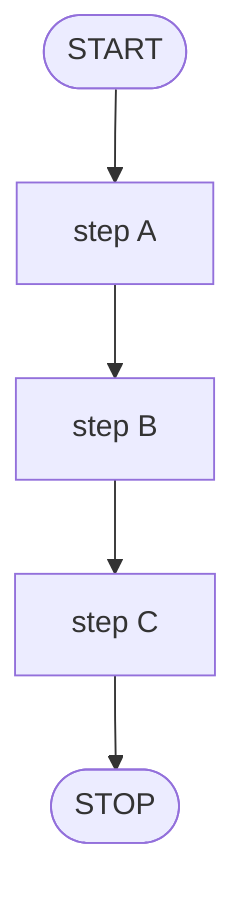
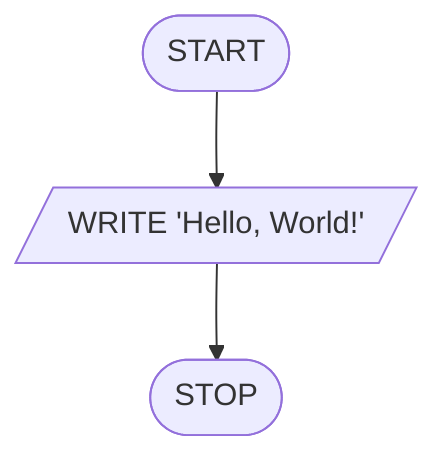
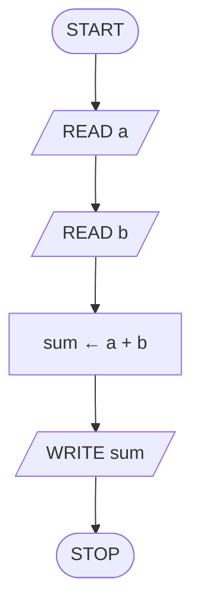
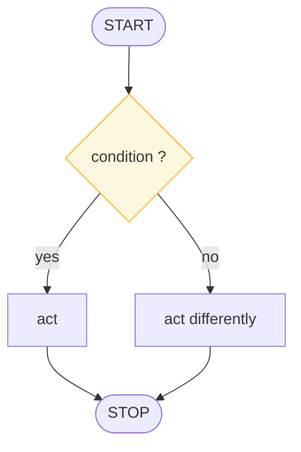
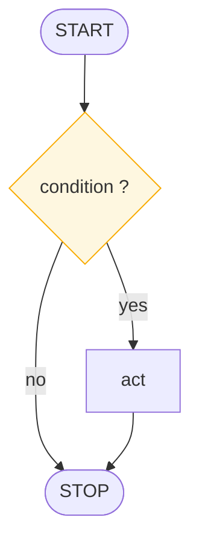
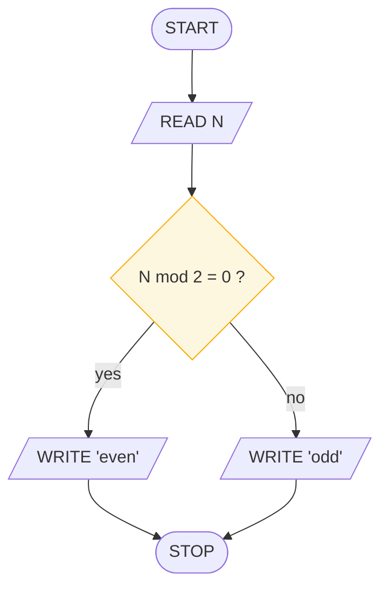
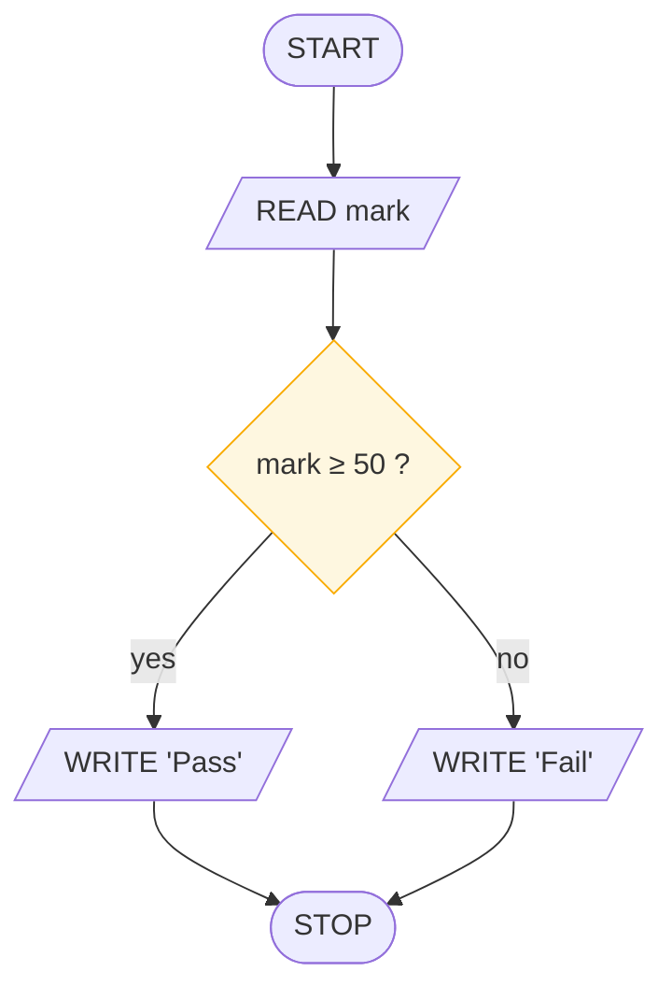
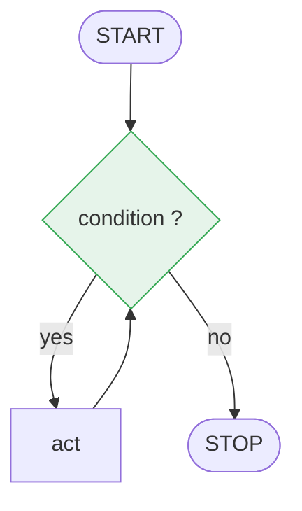
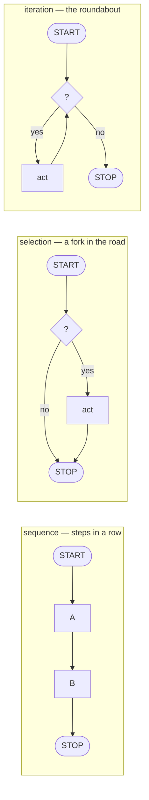

# The Three Control Patterns

> **Lesson 3 of 6** — Sequence, selection, iteration. The complete grammar of
> computation.

---

Every algorithm ever written is a braid of exactly three patterns. In 1966 Böhm and
Jacopini proved that **sequence, selection, and iteration** are sufficient to
compute anything computable. You are learning the whole language — there are only
three words.

## Pattern nº1 — sequence

Steps in a row. One at a time, in order. No surprises — the default temperament of
a program.



Three tiny programs, all pure sequence:

**Hello, flow** — three symbols, each doing honest work: the door in, the single
act, the door out.



```
IN — nothing · DO — nothing · OUT "Hello, World!"
```

**A name worth greeting** — our first input. Note the chart says nothing about
*how* to greet: fonts, punctuation, language. That is presentation, and it belongs
to the code. The chart is only concerned with the flow of data — it comes in, it
goes out.

```python
name = input("Your name? ")
print("Hello,", name)
```

**The IPO rhythm** — Input, Process, Output. Say it out loud; it is the heartbeat
of every program ever written. A parallelogram, a rectangle, a parallelogram.

```
IN  a, b · DO  sum ← a + b · OUT  sum
```



From a pocket calculator to a tax filing system, the skeleton never changes — only
the number of boxes between the parallelograms grows.

## Pattern nº2 — selection

The diamond picks a lane. One branch runs; the other costs nothing.



**Selection** is the program choosing. In a plain `if`, one branch is "do
nothing" — the flow simply flows around the box:



Two facts about the skipped branch:

1. It isn't slow, hidden, or lazy — it **does not execute**. Free.
2. **`elif` chains** are just decisions in a row: each "no" feeds the next
   question. Remember this when you meet FizzBuzz in
   [Session 9](../../module-03-algorithmic-thinking/session-09/README.md).

> A decision with only one labelled exit is a **half-answered question**. Always
> show where the other road goes, even if it goes nowhere.

### Fork and join — the first real program

**Program nº4 — odd or even.** Two new ideas at once.



```
IN  N · DO  N mod 2 ? · OUT  "even" / "odd"
```

- The **fork**: the diamond sends the flow down one of two roads.
- The **join**: both roads meet again before STOP — two paths, one destination.

The question itself is the whole trick: `mod` gives the remainder after division.
A number is even exactly when the remainder after dividing by two is zero.

```python
n = int(input("n = "))
if n % 2 == 0:
    print("even")
else:
    print("odd")
```

**Your turn — the pass/fail machine.** Read a student's mark. Print "Pass" if the
mark is 50 or more, otherwise print "Fail".

```
IN  mark · DO  mark ≥ 50 ? · OUT  "Pass" / "Fail"
```

- [ ] Draw it on paper before checking anything
- [ ] Check: fork, two labelled exits, one join, one STOP
- [ ] Watch out: is the boundary mark **≥ 50** or **> 50**? Off-by-one bugs are
      born exactly here

<details>
<summary>Answer</summary>



```python
mark = int(input("mark = "))
if mark >= 50:
    print("Pass")
else:
    print("Fail")
```

If your drawing matches the shape — fork, join, stop — you've understood
selection. The labels are details; the shape is the idea.

</details>

## Pattern nº3 — iteration

A path that bends back on itself. Steps repeat while a condition holds.



Covered in depth in [Loops and Trace Tables](loops-and-trace-tables.md), since a
loop is the one pattern you cannot get right by eye alone — it needs a table.

## The three patterns side by side



## Recognising patterns in the wild

Take any instruction you are given and sort it into one of the three buckets. This
is the "shape" step of the design method, and it is the highest-value habit in
this section.

| Instruction | Pattern | Why |
|-------------|---------|-----|
| "Read the name, then greet them" | sequence | Two steps, no condition |
| "If the mark is below 50, fail them" | selection | One condition, two outcomes |
| "Add each of these ten numbers" | iteration | The same action, repeatedly |
| "Keep asking until the answer is right" | iteration | A test that depends on progress |
| "Sort the list, then save it" | sequence | Two steps, each complex |
| "For each student, if absent, skip" | iteration + selection | A loop wrapping a fork |

Note the last two rows. Patterns **nest**. That is the point — you are not
learning three templates, you are learning three moves you can combine.

## Quick Reference

| Pattern | Shape | Cost |
|---------|-------|------|
| **Sequence** | Straight line, no branching | One pass, in order |
| **Selection** | One fork, paths rejoin | Chosen branch only; the other costs nothing |
| **Iteration** | A path returning to an earlier test | Zero, one, or many times |

## What to take away

- Three patterns. Sequence, selection, iteration. That is the whole language
- Böhm and Jacopini proved in 1966 this is *sufficient*, not merely convenient
- A fork splits; a join reunites. Both must exist
- The skipped branch of a selection costs nothing — it does not execute
- Patterns nest; you are learning moves, not templates

## Next

**[Loops and Trace Tables](loops-and-trace-tables.md)** — the pattern you cannot
verify by eye, and the table that lets you verify it anyway.

---

## Persian

[سه الگوی کنترلی](control-patterns_fa.md)