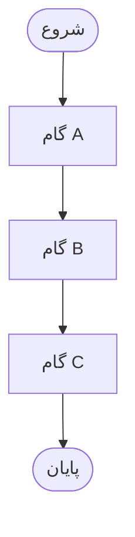
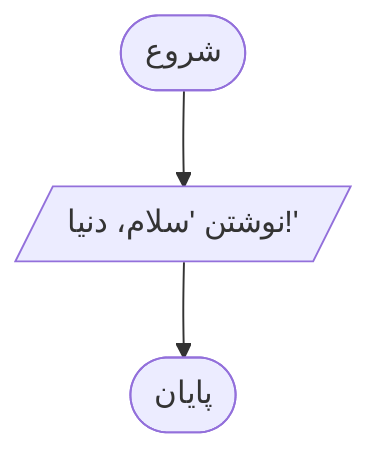
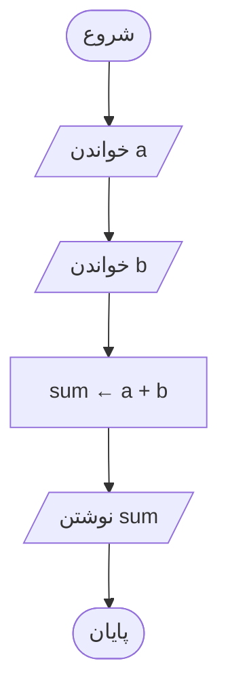
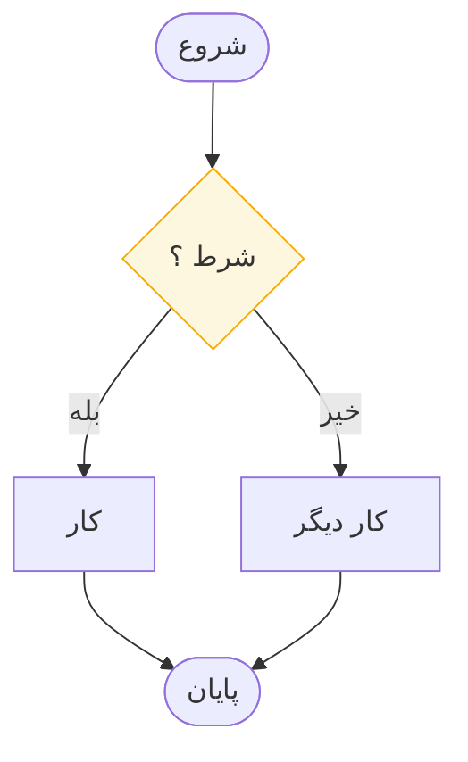
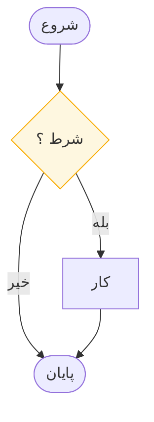
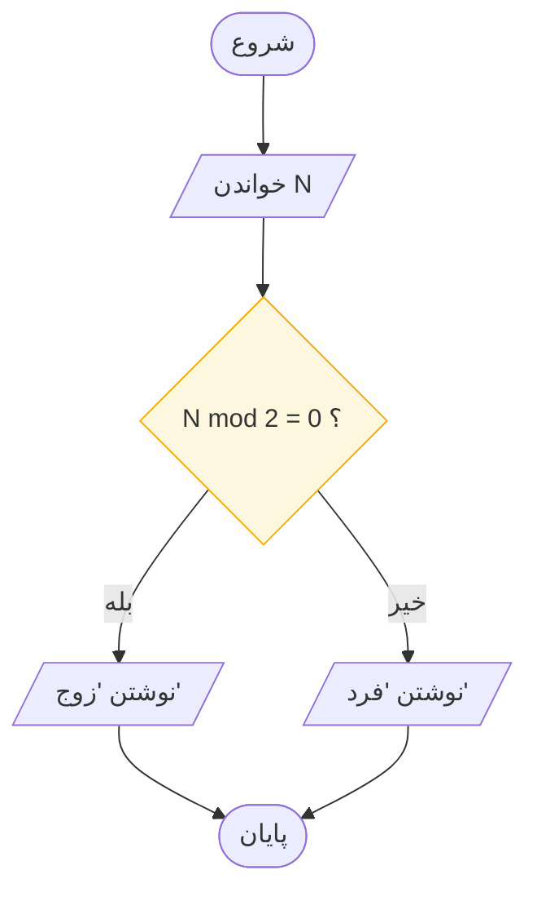
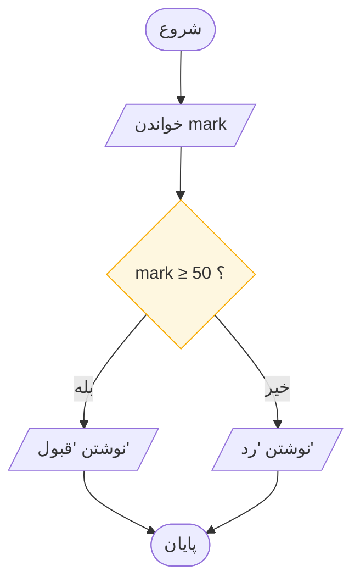
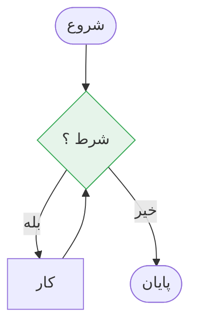
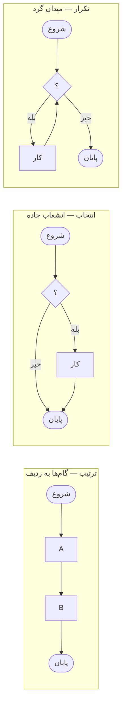

# سه الگوی کنترلی

> **درس ۳ از ۶** — ترتیب، انتخاب، تکرار. دستور زبان کامل محاسبه.

---

هر الگوریتمی که تاکنون نوشته شده بافته‌ای از دقیقاً سه الگوست. بوم و یاکوپینی
در سال ۱۹۶۶ ثابت کردند که **ترتیب، انتخاب و تکرار** برای محاسبهٔ هر چیزی که
قابل محاسبه است کافی‌اند. شما دارید کل زبان را یاد می‌گیرید — و سه کلمه دارد.

## الگوی شمارهٔ ۱ — ترتیب

گام‌ها به ردیف. یکی یکی، به ترتیب. بدون غافلگیری — خلق‌وخوی پیش‌فرض یک برنامه.



سه برنامهٔ کوچک، همه تراکیبِ خالصِ ترتیب:

**سلام، جریان** — سه نماد، هر کدام کار صادقانه‌ای انجام می‌دهند: درِ ورودی، یک
کارِ تنها، درِ خروجی.



```
IN — هیچ · DO — هیچ · OUT "سلام، دنیا!"
```

**نامی که ارزش درود دارد** — نخستین ورودی ما. توجه کنید نمودار دربارهٔ *چگونه*
درود کردن چیزی نمی‌گوید: قلم، نقطه‌گذاری، زبان. آن ارائه است و به کد تعلق دارد.
نمودار فقط به جریان داده اهمیت می‌دهد — می‌آید و می‌رود.

```python
name = input("Your name? ")
print("Hello,", name)
```

**آهنگ IPO** — ورودی، پردازش، خروجی. بلند بگویید؛ ضربان هر برنامه‌ای است که تاکنون
نوشته شده. متوازی‌الاضلاع، مستطیل، متوازی‌الاضلاع.

```
IN  a, b · DO  sum ← a + b · OUT  sum
```



از ماشین‌حساب جیبی تا سیستم مالیاتی، اسکلت هرگز تغییر نمی‌کند — تنها تعداد جعبه‌ها
میان متوازی‌الاضلاع‌ها بزرگ می‌شود.

## الگوی شمارهٔ ۲ — انتخاب

لوزی یک مسیر را انتخاب می‌کند. یک شاخه اجرا می‌شود؛ شاخهٔ دیگر هیچ هزینه‌ای
ندارد.



**انتخاب** یعنی برنامه انتخاب می‌کند. در یک `if` ساده، یکی از شاخه‌ها «هیچ کار
نکن» است — جریان صرفاً از کنار جعبه رد می‌شود:



دو نکته دربارهٔ شاخهٔ ردشده:

۱. این شاخه کند، پنهان یا تنبل نیست — اصلاً **اجرا نمی‌شود**. رایگان.
۲. **زنجیره‌های `elif`** فقط تصمیم‌هایی پشت سر هم‌اند: هر «خیر» به پرسش بعدی
   می‌رود. این را وقتی FizzBuzz را در
   [جلسه ۹](../../module-03-algorithmic-thinking/session-09/README.md) دیدید به
   خاطر بسپارید.

> تصمیمی که فقط یک خروجی برچسب‌خورده دارد، **پرسشی نیمه‌پاسخ‌داده‌شده** است. همیشه
> نشان دهید شاخهٔ دیگر کجا می‌رود، حتی اگر جایی نمی‌رود.

### انشعاب و پیوست — نخستین برنامهٔ واقعی

**برنامهٔ شمارهٔ ۴ — زوج یا فرد.** دو ایدهٔ تازه با هم.



```
IN  N · DO  N mod 2 ؟ · OUT  "زوج" / "فرد"
```

- **انشعاب**: لوزی جریان را به یکی از دو راه می‌فرستد.
- **پیوست**: هر دو راه پیش از STOP دوباره به هم می‌رسند — دو مسیر، یک مقصد.

خودِ پرسش تمام ترفند است: `mod` باقیماندهٔ تقسیم را می‌دهد. عدد دقیقاً وقتی زوج
است که باقیماندهٔ تقسیم بر دو صفر باشد.

```python
n = int(input("n = "))
if n % 2 == 0:
    print("even")
else:
    print("odd")
```

**نوبت شما — ماشین قبول/رد.** نمرهٔ دانش‌آموز را بخوان. اگر نمره ۵۰ یا بیشتر بود
«قبول» چاپ کن، در غیر این صورت «رد».

```
IN  mark · DO  mark ≥ 50 ؟ · OUT  "قبول" / "رد"
```

- [ ] پیش از هر چیز روی کاغذ رسم کنید
- [ ] بررسی کنید: انشعاب، دو خروجی برچسب‌خورده، یک پیوست، یک STOP
- [ ] مواظب باشید: نمرهٔ مرزی **≥ ۵۰** است یا **> ۵۰**؟ اشکالات یک‌واحدی دقیقاً
      از همین‌جا زاده می‌شوند

<details>
<summary>پاسخ</summary>



```python
mark = int(input("mark = "))
if mark >= 50:
    print("Pass")
else:
    print("Fail")
```

اگر رسم شما با شکل مطابقت دارد — انشعاب، پیوست، پایان — انتخاب را فهمیده‌اید.
برچسب‌ها جزئیات‌اند؛ شکل، ایده است.

</details>

## الگوی شمارهٔ ۳ — تکرار

مسیری که به خودش برمی‌گردد. گام‌ها تا وقتی شرطی برقرار باشد تکرار می‌شوند.



به‌طور عمیق در [حلقه‌ها و جدول ردیابی](loops-and-trace-tables_fa.md) پوشش داده
می‌شود، چون حلقه تنها الگویی است که نمی‌توان با چشم درست از آب درآورد — به جدول
نیاز دارد.

## سه الگو کنار هم



## تشخیص الگو در دنیای واقعی

هر دستوری که به شما داده می‌شود را در یکی از سه سطل بگذارید. این گام «شکل‌دهی»
از روش طراحی است، و باارزش‌ترین عادت این بخش است.

| دستور | الگو | چرا |
|-------|------|-----|
| «نام را بخوان، بعد به او درود کن» | ترتیب | دو گام، بدون شرط |
| «اگر نمره زیر ۵۰ است، ردش کن» | انتخاب | یک شرط، دو نتیجه |
| «این ده عدد را با هم جمع کن» | تکرار | همان کار، مکرر |
| «تا وقتی جواب درست نشده بپرس» | تکرار | آزمونی که به پیشرفت بستگی دارد |
| «لیست را مرتب کن، بعد ذخیره کن» | ترتیب | دو گام، هر کدام پیچیده |
| «برای هر دانش‌آموز، اگر غایب بود، رد شو» | تکرار + انتخاب | حلقه‌ای که یک انشعاب را در بر دارد |

به دو سطر آخر توجه کنید. الگوها **تودرتو** می‌شوند. این دقیقاً نکته است — شما سه
قالب یاد نمی‌گیرید، سه حرکت یاد می‌گیرید که می‌توانید ترکیبشان کنید.

## مرجع سریع

| الگو | شکل | هزینه |
|------|-----|-------|
| **ترتیب** | خط مستقیم، بدون انشعاب | یک بار، به ترتیب |
| **انتخاب** | یک انشعاب، مسیرها دوباره به هم می‌رسند | فقط شاخهٔ انتخاب‌شده؛ شاخهٔ دیگر هیچ هزینه‌ای ندارد |
| **تکرار** | مسیری که به آزمون قبلی برمی‌گردد | صفر، یک، یا بارها |

## آنچه باید به خاطر بسپارید

- سه الگو. ترتیب، انتخاب، تکرار. تمام زبان همین است
- بوم و یاکوپینی در ۱۹۶۶ ثابت کردند این‌ها *کافی*‌اند، نه فقط سودمند
- انشعاب تقسیم می‌کند؛ پیوست دوباره یکی می‌کند. هر دو باید وجود داشته باشند
- شاخهٔ ردشدهٔ یک انتخاب هیچ هزینه‌ای ندارد — اجرا نمی‌شود
- الگوها تودرتو می‌شوند؛ شما حرکت یاد می‌گیرید، نه قالب

## بعدی

**[حلقه‌ها و جدول ردیابی](loops-and-trace-tables_fa.md)** — الگویی که با چشم
نمی‌توان تأییدش کرد، و جدولی که این کار را برایتان ممکن می‌کند.

---

## English

[The Three Control Patterns](control-patterns.md)