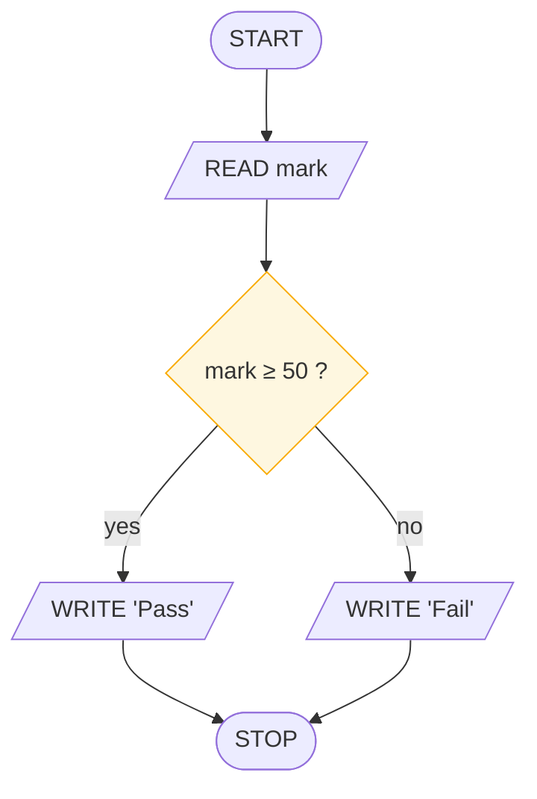
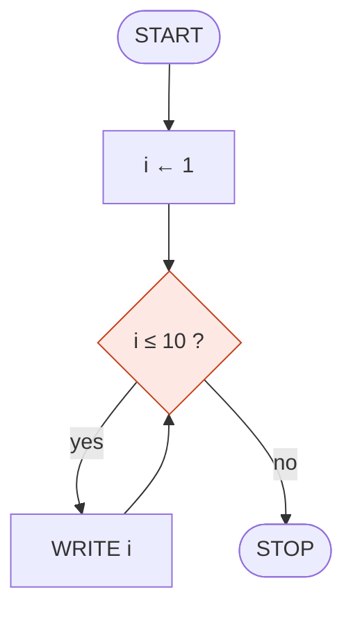
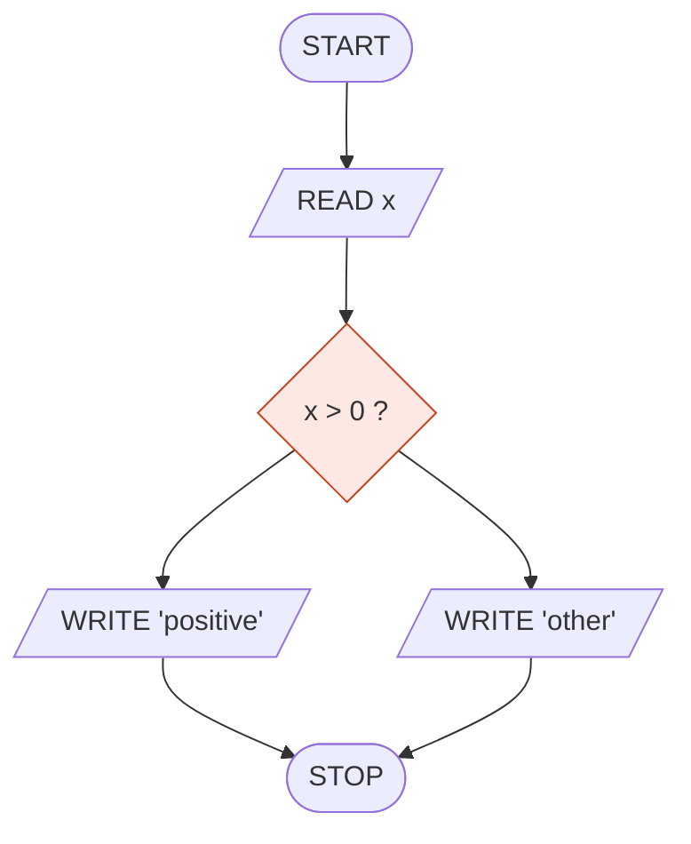
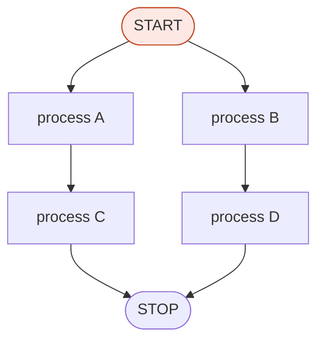
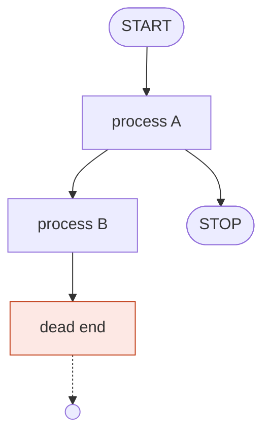

# Design Method and Review Checklist

> **Lesson 5 of 6** — Problem to chart in five moves, the four ways charts break,
> and the checklist every code review is wearing a lanyard of.

---

## From problem to flowchart in five moves

The hardest part of a flowchart is not drawing it. It is the moment before, when
you have a wordy problem and nothing yet. Five moves get you there.

### 01 · Restate

Say what comes **in** and what must come **out** — the IPO strip.

```
IN  mark · DO  mark ≥ 50 ? · OUT  "Pass" / "Fail"
```

If you can't state it, no chart will save you. This is also where you discover
that you don't understand the problem — which is exactly what you wanted to know,
before you drew anything.

### 02 · Spill

List the steps in plain words, in order, unpolished.

```
1. ask for the mark
2. if it's 50 or more, say Pass
3. otherwise say Fail
```

Bad English now saves bad logic later. Do not polish this list. Polishing is
where you convince yourself of something you haven't checked.

### 03 · Shape

Mark each step as **sequence**, **selection**, or **iteration**.

```
1. ask for the mark          → sequence (I/O)
2. if it's 50 or more        → selection (decision)
3. otherwise                 → selection (the other branch)
4. say the result            → sequence (I/O)
```

You are not drawing yet — you're sorting thoughts into the three patterns. Most
problems turn out to be 80% sequence with one decision buried in the middle, and
you cannot see that until this step.

### 04 · Draw

Boxes, diamonds, arrows. Label every exit yes/no. One action per box, one question
per diamond.



### 05 · Dry-run

Trace a small input with a table. Fix the chart while mistakes are still made of
pencil.

| step | symbol | mark | mark ≥ 50 ? | output |
|------|--------|------|-------------|--------|
| 1 | `READ mark` | 49 | — | — |
| 2 | `mark ≥ 50 ?` | 49 | 49 | no |
| 3 | `WRITE "Fail"` | 49 | — | Fail |
| 4 | `READ mark` | 50 | — | — |
| 5 | `mark ≥ 50 ?` | 50 | 50 | yes |
| 6 | `WRITE "Pass"` | 50 | — | Pass |

Both boundary values. If you had written `>` instead of `≥`, the trace would have
caught it on row 5 — a fifty marks, and it says Fail.

## Four ways to break a flowchart

Every mistake a chart can make, in four pictures. These are worth recognising
instantly, because all four are visible without reading the labels.

### 01 · The infinite loop

The test can never go false. Something in the body must work toward the exit;
otherwise you've drawn a trap.



`i` is never incremented. The test stays true forever.

### 02 · The silent question

Exits without labels. Is it yes or no? The reader has to guess, and guessing is
where bugs live.



Both exits leave the diamond, neither says which condition leads where.

### 03 · Spaghetti

Lines crossing and touching, meaning blurring. Not a style sin — an **ambiguity**.
Which path does the data take?



Two entries into START (violates §1), and the two paths cross. Route around, or
use connectors.

### 04 · The dangling arrow

An arrow from nothing, or to nowhere. Every path must be traceable from START to
a STOP.



`dead end` goes nowhere. A reader who follows that line never learns what the
program does.

## The review checklist

Before any chart earns the right to become code:

- [ ] Exactly one START, and every path reaches a STOP
- [ ] Every decision's exits are labelled yes / no
- [ ] One arrow enters each symbol — never more
- [ ] Arrows flow down or right; anything else carries an arrowhead
- [ ] No line crosses, touches, or cuts through a symbol
- [ ] Every loop has a step that can make its test false
- [ ] One action per rectangle; one question per diamond
- [ ] It has been dry-run on paper, with a table

> Print this list. Pin it above your desk. Every professional code review you'll
> ever sit in is **this list wearing a lanyard**.

## One algorithm, three languages

The translation chart → pseudocode → code should be **mechanical**, almost boring.

**Flowchart** — see [the pass/fail chart above](#from-problem-to-flowchart-in-five-moves).

**Pseudocode** — the sentence:

```
READ mark
IF mark ≥ 50 THEN
    WRITE "Pass"
ELSE
    WRITE "Fail"
ENDIF
STOP
```

**Python** — the dialect:

```python
mark = int(input())
if mark >= 50:
    print("Pass")
else:
    print("Fail")
```

The day that translation isn't boring, the problem is not your Python — it's that
the chart on the left isn't finished. Go back to move 05.

## The shape of cost

The silhouette of a chart predicts how long it takes to run. Learn this now, and
big-O in Session 9 will feel obvious.

| Shape | Cost | Reads as |
|-------|------|----------|
| Straight line | **O(1)** | Same handful of steps no matter the input |
| One loop | **O(n)** | Double the input, double the work |
| A loop that discards half each pass | **O(log n)** | A million items, twenty questions |
| A loop inside a loop | **O(n²)** | Every item meets every item |

Counting, summing, linear search: **O(n)**. Binary search, because each comparison
throws away half the world: **O(log n)**. Bubble sort, a loop inside a loop:
**O(n²)** — ten thousand items costs a hundred million comparisons.

This is a genuinely useful thing to know at the level of *drawing*. Before you
write the code, you can see which charts will scale and which will not.

## Beyond flowcharts

The family of notations that all share one inheritance — boxes, arrows, and
unambiguous meaning:

| Notation | What it adds |
|----------|--------------|
| **Nassi–Shneiderman** | Flowcharts with the arrows banned. Structure becomes geometry — nesting is literally nesting |
| **Pseudocode** | The chart spoken aloud. Same logic, no geometry, still no syntax |
| **UML activity diagrams** | Flowcharts in a suit: swimlanes for who does what, true parallelism with forks and joins |
| **Data-flow diagrams** | Not steps inside a program, but what moves between systems |
| **State machines** | Decisions chained until the chart becomes a map of every possible situation |

Learn the flowchart and you can read the whole family tree.

## What to take away

- Five moves: restate, spill, shape, draw, dry-run
- The shape step is where you discover the algorithm's skeleton
- Four ways charts break: infinite loop, silent question, spaghetti, dangling arrow
- The eight-point checklist is the complete review
- Chart → pseudocode → code should be boring. If it isn't, go back to dry-run
- The silhouette predicts the cost

## Next

**[Workshop: Three Briefs](workshop-briefs.md)** — apply the five moves to three
real problems, with hints and an answer key.

---

## Persian

[روش طراحی و چک‌لیست بازبینی](design-method-and-review_fa.md)