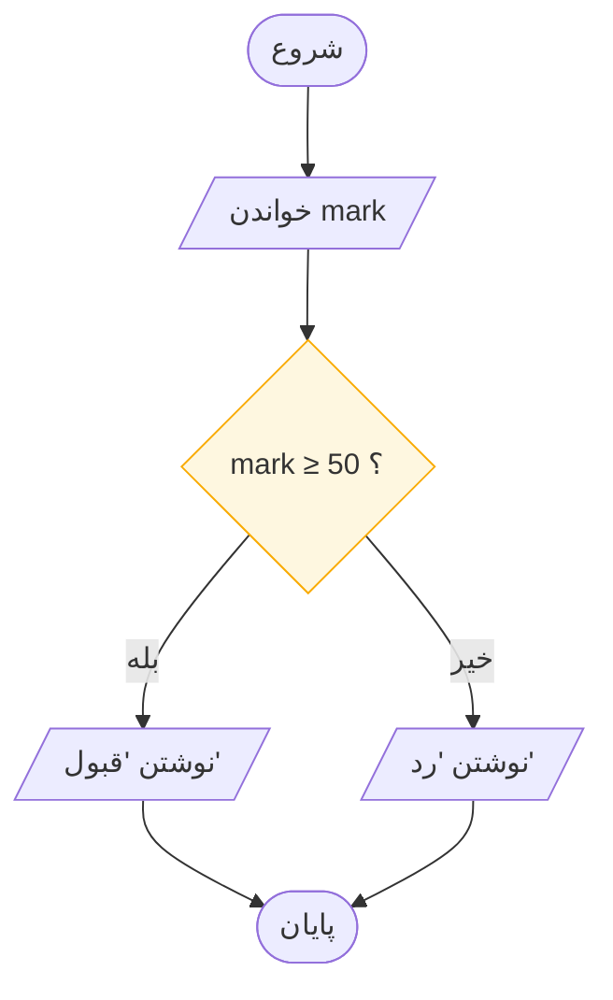
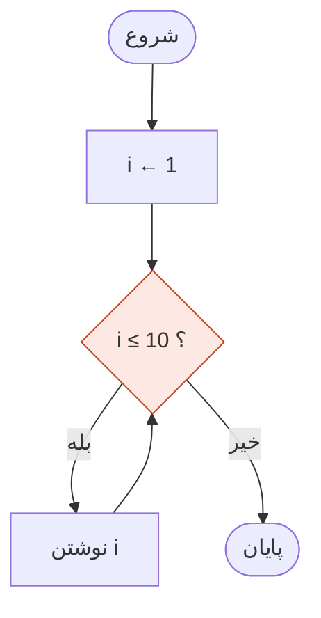
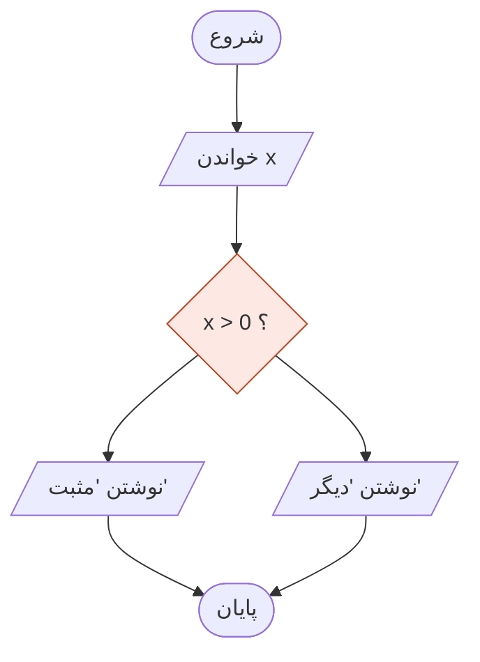
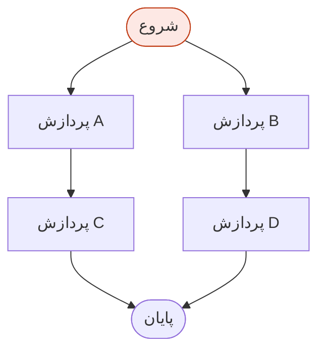
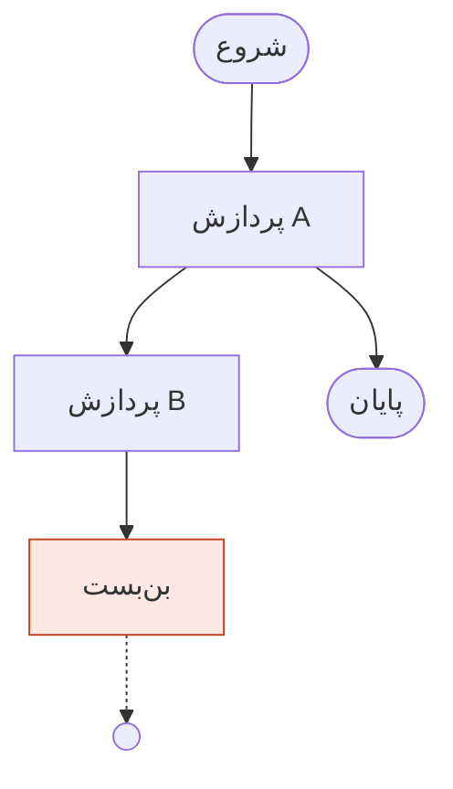

# روش طراحی و چک‌لیست بازبینی

> **درس ۵ از ۶** — از مسئله تا نمودار در پنج گام، چهار راه خراب شدن نمودار، و
> چک‌لیستی که هر بازبینی کد حرفه‌ای یک بند از آن به گردن دارد.

---

## از مسئله تا فلوچارت در پنج گام

سخت‌ترین بخش یک فلوچارت رسم کردنش نیست. لحظهٔ پیش از آن است، وقتی یک مسئلهٔ
پرکلمه دارید و هنوز هیچ. پنج گام شما را به آنجا می‌رساند.

### ۰۱ · بازگویی

بگویید چه چیزی **وارد** می‌شود و چه چیزی باید **بیرون** بیاید — نوار IPO.

```
IN  mark · DO  mark ≥ 50 ؟ · OUT  "قبول" / "رد"
```

اگر نمی‌توانید بیانش کنید، هیچ نموداری نجاتتان نمی‌دهد. این هم‌زمان جایی است که
می‌فهمید مسئله را درست نفهمیده‌اید — دقیقاً همان چیزی که می‌خواستید پیش از رسم
هیچ چیز بدانید.

### ۰۲ · ریختن

گام‌ها را به زبان ساده، به ترتیب، بی‌پرده فهرست کنید.

```
1. نمره را بپرس
2. اگر ۵۰ یا بیشتر بود، بگو قبول
3. در غیر این صورت بگو رد
```

زبان بد الان از منطق بد بعداً جلوگیری می‌کند. این فهرست را جلا ندهید. جلا دادن جایی
است که خودتان را قانع می‌کنید به چیزی که بررسی نکرده‌اید.

### ۰۳ · شکل‌دهی

هر گام را به‌عنوان **ترتیب**، **انتخاب** یا **تکرار** علامت بزنید.

```
1. نمره را بپرس                → ترتیب (ورودی/خروجی)
2. اگر ۵۰ یا بیشتر بود         → انتخاب (تصمیم)
3. در غیر این صورت             → انتخاب (شاخهٔ دیگر)
4. نتیجه را بگو                → ترتیب (ورودی/خروجی)
```

هنوز رسم نمی‌کنید — دارید افکار را در سه الگو دسته‌بندی می‌کنید. بیشتر مسئله‌ها
در نهایت ۸۰٪ ترتیب با یک تصمیم دفن‌شده در میانه از آب درمی‌آیند، و تا این گام آن
را نمی‌بینید.

### ۰۴ · رسم

جعبه، لوزی، فلش. هر خروجی با بله/خیر برچسب بخورد. هر جعبه یک کار، هر لوزی یک پرسش.



### ۰۵ · اجرای خشک

یک ورودی کوچک را با جدول ردیابی کنید. نمودار را درست کنید درست وقتی که اشتباه‌ها
هنوز از مداد ساخته شده‌اند.

| گام | نماد | mark | mark ≥ 50 ؟ | خروجی |
|-----|------|------|-------------|--------|
| ۱ | `خواندن mark` | 49 | — | — |
| ۲ | `mark ≥ 50 ؟` | 49 | 49 | خیر |
| ۳ | `نوشتن "رد"` | 49 | — | رد |
| ۴ | `خواندن mark` | 50 | — | — |
| ۵ | `mark ≥ 50 ؟` | 50 | 50 | بله |
| ۶ | `نوشتن "قبول"` | 50 | — | قبول |

هر دو مقدار مرزی. اگر به‌جای `≥` نوشته بودید `>`، ردیابی در ردیف ۵ آن را می‌گرفت
— نمرهٔ پنجاه، و می‌گفت رد.

## چهار راه خراب شدن یک فلوچارت

هر اشتباهی که یک نمودار می‌تواند بکند، در چهار تصویر. این‌ها ارزش آن را دارند که
بی‌درنگ تشخیص داده شوند، چون هر چهار بدون خواندن برچسب‌ها هم دیده می‌شوند.

### ۰۱ · حلقهٔ بی‌نهایت

آزمون هرگز نمی‌تواند نادرست شود. چیزی در بدنه باید به سمت خروج کار کند؛ وگرنه
تله کشیده‌اید.



`i` هرگز یکی اضافه نمی‌شود. آزمون برای همیشه درست می‌ماند.

### ۰۲ · پرسش خاموش

خروجی‌ها بدون برچسب. کدام است بله و کدام خیر؟ خواننده باید حدس بزند، و حدس زدن
همان‌جایی است که اشکالات زندگی می‌کنند.



هر دو خروجی از لوزی بیرون می‌آیند، اما هیچ‌کدام نمی‌گوید کدام شرط به کجا می‌رسد.

### ۰۳ · اسپاگتی

خطوطی که از روی هم عبور می‌کنند و لمس می‌شوند، و معنایی که تار می‌شود. فقط یک گناه
سبک نیست — یک **ابهام** است. داده از کدام مسیر می‌رود؟



دو ورودی به START (نقض §۱)، و دو مسیر از روی هم رد می‌شوند. دور بزنید، یا از
رابط‌ها استفاده کنید.

### ۰۴ · فلش آویزان

فلشی از هیچ، یا به هیچ‌کجا. هر مسیر باید از START تا یک STOP قابل ردیابی باشد.



`بن‌بست` به هیچ‌جا نمی‌رود. خواننده‌ای که آن خط را دنبال کند هرگز نمی‌فهمد برنامه
چه می‌کند.

## چک‌لیست بازبینی

پیش از آنکه هر نموداری حق تبدیل شدن به کد را به دست آورد:

- [ ] دقیقاً یک START، و هر مسیر به یک STOP می‌رسد
- [ ] خروجی‌های هر تصمیم با بله / خیر برچسب خورده‌اند
- [ ] فقط یک فلش وارد هر نماد می‌شود — هرگز بیشتر
- [ ] فلش‌ها رو به پایین یا راست؛ هر چیز دیگر سرِ پیکان دارد
- [ ] هیچ خطی عبور نمی‌کند، لمس نمی‌کند، یا از نمادی نمی‌گذرد
- [ ] هر حلقه گامی دارد که می‌تواند آزمونش را نادرست کند
- [ ] هر مستطیل یک کار؛ هر لوزی یک پرسش
- [ ] روی کاغذ، با جدول، اجرای خشک شده است

> این فهرست را چاپ کنید. بالای میزتان بزنید. هر بازبینی کد حرفه‌ای که در آن شرکت
> خواهید کرد، **همین فهرست با یک بند کاری** است.

## یک الگوریتم، سه زبان

ترجمهٔ نمودار ← شبه‌کد ← کد باید **مکانیکی** باشد، تقریباً خسته‌کننده.

**فلوچارت** — [نمودار قبول/رد بالا](#۰۴--رسم).

**شبه‌کد** — جمله:

```
READ mark
IF mark ≥ 50 THEN
    WRITE "Pass"
ELSE
    WRITE "Fail"
ENDIF
STOP
```

**پایتون** — گویش:

```python
mark = int(input())
if mark >= 50:
    print("Pass")
else:
    print("Fail")
```

روزی که این ترجمه خسته‌کننده نباشد، مشکل از پایتون شما نیست — این است که نمودار
سمت چپ تمام نشده است. برگردید به گام ۰۵.

## شکل هزینه

silhouette نمودار پیش‌بینی می‌کند که اجرایش چقدر طول می‌کشد. این را همین حالا یاد
بگیرید، و بی‌اُس‌دابلو در جلسه ۹ بدیهی به نظر می‌رسد.

| شکل | هزینه | خوانش |
|-----|-------|-------|
| خط مستقیم | **O(1)** | همان چند گام، مستقل از ورودی |
| یک حلقه | **O(n)** | دو برابر ورودی، دو برابر کار |
| حلقه‌ای که هر دور نصف جهان را دور می‌ریزد | **O(log n)** | یک میلیون قلم، بیست پرسش |
| حلقه‌ای درون حلقه | **O(n²)** | هر قلم با هر قلم روبه‌رو می‌شود |

شمردن، جمع کردن، جست‌وجوی خطی: **O(n)**. جست‌وجوی دودویی، چون هر مقایسه نصف جهان
را دور می‌ریزد: **O(log n)**. مرتب‌سازی حبابی، حلقه درون حلقه: **O(n²)** — ده هزار
قلم، صد میلیون مقایسه هزینه دارد.

این چیزی است که دانستنش در سطح *رسم کردن* واقعاً مفید است. پیش از نوشتن کد می‌توانید
ببینید کدام نمودارها مقیاس می‌گیرند و کدام‌ها نه.

## فراتر از فلوچارت

خانوادهٔ نمادهایی که همگی یک میراث مشترک دارند — جعبه‌ها، فلش‌ها، و معنای بدون
ابهام:

| نماد | چه چیزی اضافه می‌کند |
|------|--------------------|
| **ناسی–شنیدرمن** | فلوچارت با فلش ممنوع. ساختار به هندسه تبدیل می‌شود — تودرتویی واقعاً تودرتو است |
| **شبه‌کد** | نمودار با صدای بلند. همان منطق، بدون هندسه، هنوز بدون نحو |
| **نمودار فعالیت UML** | فلوچارت با کت‌وشلوار: لاین‌های شناور برای اینکه چه کسی چه می‌کند، موازی‌سازی واقعی با انشعاب و پیوست |
| **نمودار جریان داده** | نه گام‌های داخل یک برنامه، بلکه آنچه بین سامانه‌ها جابه‌جا می‌شود |
| **ماشین حالت** | تصمیم‌های زنجیرشده تا جایی که خود نمودار به نقشهٔ همهٔ موقعیت‌های ممکن تبدیل می‌شود |

فلوچارت را یاد بگیرید و کل شجرهٔ خانوادگی را می‌توانید بخوانید.

## آنچه باید به خاطر بسپارید

- پنج گام: بازگویی، ریختن، شکل‌دهی، رسم، اجرای خشک
- گام شکل‌دهی جایی است که اسکلت الگوریتم کشف می‌شود
- چهار راه خراب شدن: حلقهٔ بی‌نهایت، پرسش خاموش، اسپاگتی، فلش آویزان
- چک‌لیست هشت‌موردی، بازبینی کامل است
- نمودار ← شبه‌کد ← کد باید خسته‌کننده باشد. اگر نبود، به اجرای خشک برگردید
- شکل نمودار هزینه را پیش‌بینی می‌کند

## بعدی

**[کارگاه: سه تمرین](workshop-briefs_fa.md)** — به کار بردن پنج گام روی سه مسئلهٔ
واقعی، با راهنما و پاسخ‌نامه.

---

## English

[Design Method and Review Checklist](design-method-and-review.md)