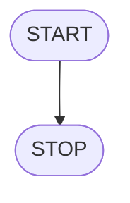
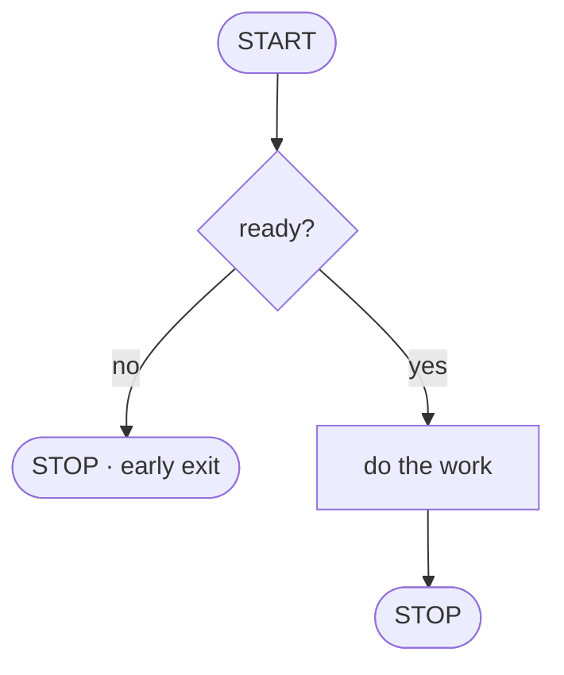
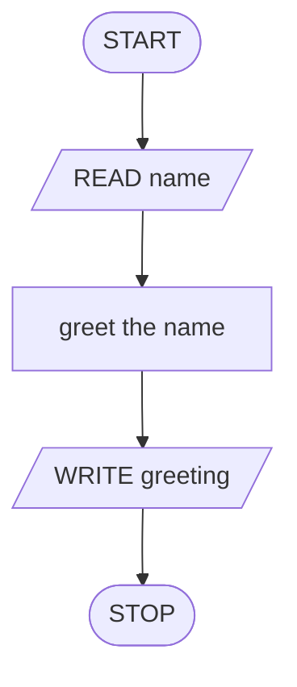
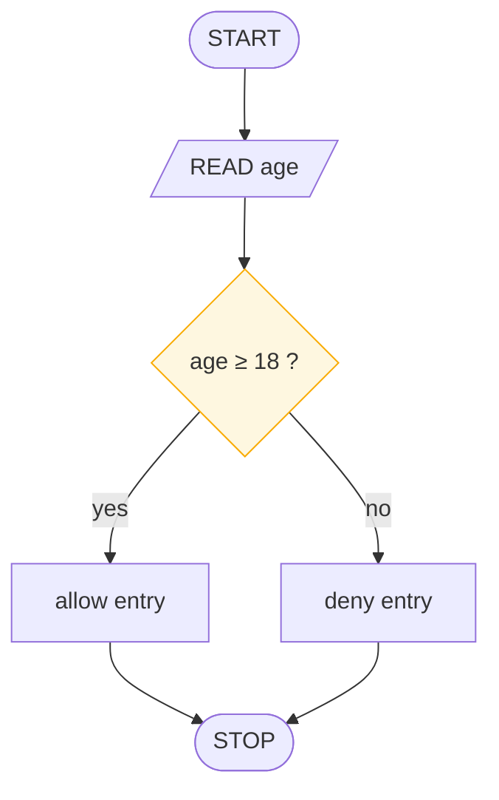
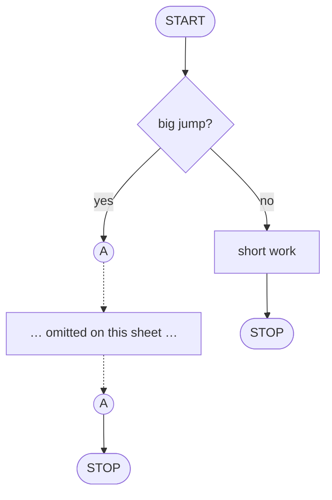

# The Six Symbols

> **Lesson 2 of 6** — Terminator, process, I/O, decision, flow line, connector.
> The complete vocabulary of ISO 5807.

---

A flowchart is drawn from six shapes. Learn these six and you can read any chart
in the world — professional specifications, textbook diagrams, and this course
all use the same vocabulary.

| Symbol | Name | Purpose |
|--------|------|---------|
| ⬭ | **Terminator** | Start and end points. Rounded ends |
| ⬜ | **Process** | Actions, calculations, assignments |
| 🗄️ | **Input/Output** | Reading input or writing output |
| 🔷 | **Decision** | Yes/no questions, conditions |
| ➡️ | **Flow line** | Direction of execution |
| ◯ | **Connector** | Splices long jumps without drawing the line |

## 1. The terminator — doors of the algorithm

The terminator is the rounded shape that says where you are and where you end.
**START** is where the journey begins. **STOP** is where it ends.

**The shortest algorithm in the world** is a terminator with nothing in between:



A slightly more honest one, with an early exit:



Three rules govern terminators:

| Rule | Statement |
|------|-----------|
| **R1** | **Exactly one START.** Nothing may flow into it — a journey has one door in |
| **R2** | **At least one STOP.** Several are fine; early exits are a legitimate way to leave |
| **R3** | **Rounded ends only.** If your first shape isn't a terminator, the reader is already lost |

Convention in this course: START is drawn **filled**, STOP is drawn **open**. Ink
in, air out.

## 2. The process box — one box, one job

The rectangle is where work happens. Calculation, assignment, state change. One
box does exactly one thing.

```
        ┌──────────────────────┐
        │   x ← x + 3          │
        └──────────────────────┘
```

Three rules:

| Rule | Statement |
|------|-----------|
| **R1** | **One action per box.** Two actions means two boxes |
| **R2** | **`←` means *becomes*.** It is not "equals" — `x ← 5` overwrites x |
| **R3** | **No questions allowed.** A rectangle never asks; asking is the diamond's whole career |

Trace this short chain by hand: `x ← 5`, then `x ← x + 3`, then `x ← x * 2`.
The value at the end is **16**. If you cannot trace a chart by hand, you cannot
write the code for it.

```python
x = 5
x = x + 3
x = x * 2
print(x)   # 16
```

## 3. Input / output — the parallelogram

The slanted shape. The slant is a hint: data leaning in from, or out to, the
outside world.



Three rules:

| Rule | Statement |
|------|-----------|
| **R1** | **READ is what the program needs** from the outside world: a number, a name, a click, a file |
| **R2** | **WRITE is what it gives back** |
| **R3** | **Do the work in rectangles.** A parallelogram only moves data; it never transforms it |

**Good habit:** list your inputs and outputs *before* any logic. Most bad
programs were charted backwards — the author drew the calculation first and
realised afterwards what data it needed.

## 4. The decision — a question with two answers

The diamond is where programs stop being recipes and start being machines that
choose.



Three rules:

| Rule | Statement |
|------|-----------|
| **R1** | **Phrase it as a yes/no question.** "age ≥ 18 ?" — not "check the age". The diamond is binary; respect that |
| **R2** | **Label every exit** — yes / no, true / false, = / ≠. An unlabelled branch is a bug waiting for a programmer |
| **R3** | **Compound conditions are one question in a suit.** "x > 0 AND y > 0 ?" is still a single yes/no |

## 5. Flow lines — the arrows

Arrows say which symbol runs next. Three rules:

| Rule | Statement |
|------|-----------|
| **R1** | **Default direction: top → bottom, left → right.** Against the current? Then an arrowhead is mandatory |
| **R2** | **One arrow enters any symbol.** Many may leave a diamond; never the reverse |
| **R3** | **Lines never cross, touch, or cut through symbols.** Crossings are ambiguity; ambiguity is tomorrow's bug |

A crossed line is not a style sin. It is an **ambiguity**: which path does the
data take? Route around, always.

```
  ✗ wrong — the crossing          ✓ right — around the outside

        ┌─────────┐                      ┌─────────┐
        │ process │                      │ process │
        └────┬────┘                      └───┬─┬───┘
             │                              │ │
        ┌────┴────┐            ┌───────────┐ │ │
        │ process │            │ process   │ │ │
        └─────────┘            └───────────┘ │ │
                                               │
        both lines pass through here    separate and clear
```

## 6. Connectors — splicing the long jumps

When a flow line would have to travel a long distance across the sheet, draw a
small circle instead. An arrow dives into a circle labelled **A**, and re-emerges
from another **A** elsewhere on the sheet. Same letter, same wire.



In plain text, a connector pair is:

```
    ┌──────┐
    │  A   │──▶ (continues at the other A, elsewhere on the sheet)
    └──────┘
```

The pentagon version means **"continues on another sheet"** — same letter, same
wire, different page.

## The five laws of any flowchart

Every rule above compresses into five laws. These are worth memorising; they are
the entire specification.

| Law | Statement |
|-----|-----------|
| **§1** | Exactly **one START**; every path eventually reaches **a STOP** |
| **§2** | Every decision has **labelled exits** |
| **§3** | One arrow **enters** a symbol; flows merge, never fork, on entry |
| **§4** | Lines follow the current, or carry **an arrowhead** |
| **§5** | Lines **never cross**, touch, or pass through symbols |

A chart that breaks any of these is not merely ugly — it is ambiguous, and
ambiguity becomes a bug at the worst possible moment.

## Quick Reference

| Shape | Meaning | Contains | Never contains |
|-------|---------|----------|-----------------|
| Rounded | Start / Stop | START, STOP | Any work |
| Rectangle | Process | One action, `←` | A question |
| Parallelogram | Input / Output | READ, WRITE | Computation |
| Diamond | Decision | One yes/no question | Two questions |
| Arrow | Flow line | Nothing | Labels (except yes/no) |
| Circle | Connector | A letter | Any work |

## What to take away

- Six shapes. That is the entire vocabulary
- One action per box, one question per diamond — no exceptions
- `←` means *becomes*, not *equals*
- Labelled exits are mandatory; unlabelled branches are future bugs
- The five laws are the complete specification

## Next

**[The Three Control Patterns](control-patterns.md)** — with the vocabulary in
hand, you can see the three shapes every algorithm is built from.

---

## Persian

[شش نماد فلوچارت](flowchart-symbols_fa.md)