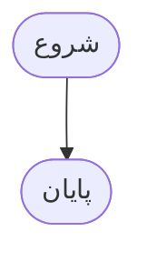
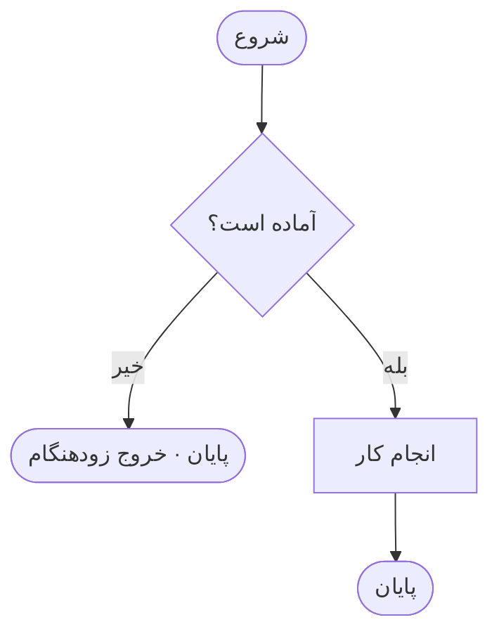
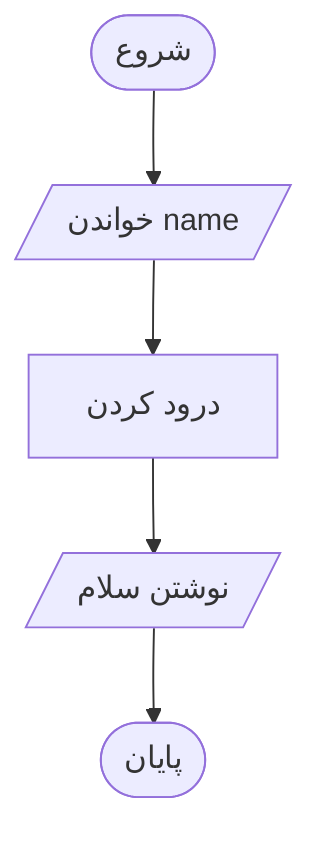
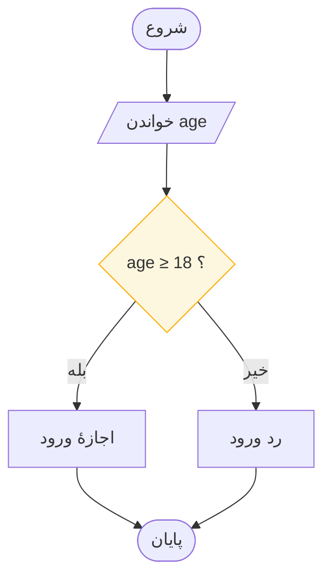
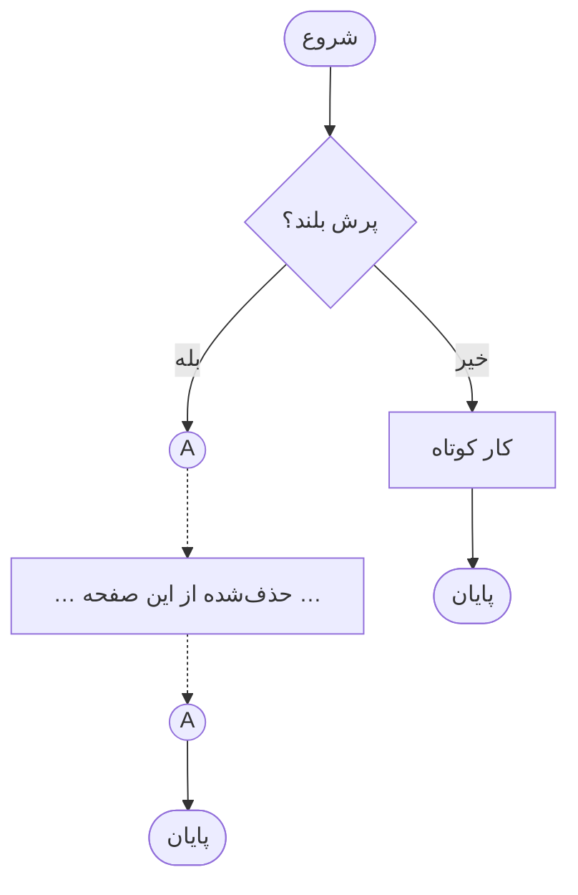

# شش نماد فلوچارت

> **درس ۲ از ۶** — پایان‌دهنده، پردازش، ورودی/خروجی، تصمیم، فلش، رابط.
> واژگان کامل ISO 5807.

---

فلوچارت از شش شکل کشیده می‌شود. این شش را یاد بگیرید و می‌توانید هر نموداری را
در دنیا بخوانید — مشخصات حرفه‌ای، نمودارهای کتاب‌های درسی و این دوره همگی از
یک واژگان استفاده می‌کنند.

| نماد | نام | کاربرد |
|------|-----|--------|
| ⬭ | **پایان‌دهنده** | نقاط شروع و پایان. دو سر گرد |
| ⬜ | **پردازش** | کنش‌ها، محاسبات، انتساب‌ها |
| 🗄️ | **ورودی/خروجی** | خواندن ورودی یا نوشتن خروجی |
| 🔷 | **تصمیم** | پرسش‌های بله/خیر، شرط‌ها |
| ➡️ | **فلش جریان** | جهت اجرا |
| ◯ | **رابط** | پرش‌های بلند را بدون کشیدن خط می‌دوزد |

## ۱. پایان‌دهنده — درهای الگوریتم

پایان‌دهنده شکل گردی است که می‌گوید کجا هستید و کجا تمام می‌شود. **شروع**
جایی است که سفر آغاز می‌شود. **پایان** جایی است که تمام می‌شود.

**کوتاه‌ترین الگوریتم جهان** یک پایان‌دهنده است با هیچ چیزی در میانه:



و یکی کمی صادقانه‌تر، با خروج زودهنگام:



سه قانون پایان‌دهنده را کنترل می‌کنند:

| قانون | گزاره |
|-------|-------|
| **R1** | **دقیقاً یک START.** هیچ چیز نباید به آن وارد شود — یک سفر یک ورودی دارد |
| **R2** | **دست‌کم یک STOP.** چند تا هم اشکالی ندارد — خروج‌های زودهنگام راه مشروعی برای خروج‌اند |
| **R3** | **فقط دو سر گرد.** اگر اولین شکل شما پایان‌دهنده نباشد، خواننده از همین حالا گم شده است |

قرارداد این دوره: START **پُر** رسم می‌شود، STOP **خالی**. جوهر داخل، هوا بیرون.

## ۲. جعبهٔ پردازش — یک جعبه، یک کار

مستطیل جایی است که کار انجام می‌شود. محاسبه، انتساب، تغییر حالت. هر جعبه دقیقاً
یک کار می‌کند.

```
        ┌──────────────────────┐
        │   x ← x + 3          │
        └──────────────────────┘
```

سه قانون:

| قانون | گزاره |
|-------|-------|
| **R1** | **هر جعبه یک کار.** دو کار یعنی دو جعبه |
| **R2** | **`←` یعنی *می‌شود*.** این «برابر است» نیست — `x ← 5` مقدار x را بازنویسی می‌کند |
| **R3** | **پرسش مجاز نیست.** مستطیل هرگز نمی‌پرسد؛ پرسیدن تمام کارِ لوزی است |

این زنجیرهٔ کوتاه را با دست ردیابی کنید: `x ← 5`، سپس `x ← x + 3`، سپس
`x ← x * 2`. مقدار نهایی **۱۶** است. اگر نمی‌توانید نموداری را با دست ردیابی
کنید، نمی‌توانید کدش را هم بنویسید.

```python
x = 5
x = x + 3
x = x * 2
print(x)   # 16
```

## ۳. ورودی / خروجی — متوازی‌الاضلاع

شکل مورب. مورب بودن یک اشاره است: داده‌ای که از دنیای بیرون به داخل می‌آید، یا
به بیرون می‌رود.



سه قانون:

| قانون | گزاره |
|-------|-------|
| **R1** | **خواندن آن چیزی است که برنامه از دنیای بیرون لازم دارد**: یک عدد، یک نام، یک کلیک، یک فایل |
| **R2** | **نوشتن آن چیزی است که پس می‌دهد** |
| **R3** | **کار را در مستطیل انجام دهید.** متوازی‌الاضلاع فقط داده جابه‌جا می‌کند؛ هرگز آن را تبدیل نمی‌کند |

**عادت خوب:** ورودی‌ها و خروجی‌هایتان را *پیش از* هر منطقی فهرست کنید. بیشتر
برنامه‌های بد از آخر به اول نمودار شده‌اند — نویسنده اول محاسبه را کشید و بعداً
فهمید چه داده‌ای لازم داشته است.

## ۴. تصمیم — پرسشی با دو پاسخ

لوزی جایی است که برنامه‌ها از دستور پخت‌وپز به ماشین‌های انتخاب‌گر تبدیل می‌شوند.



سه قانون:

| قانون | گزاره |
|-------|-------|
| **R1** | **آن را به شکل پرسش بله/خیر بیان کنید.** «age ≥ 18 ؟» — نه «بررسی کن سن را». لوزی دوتایی است؛ احترام بگذارید |
| **R2** | **هر خروجی را برچسب بزنید** — بله/خیر، درست/نادرست، = / ≠. شاخهٔ بدون برچسب، اشکالی است که منتظر برنامه‌نویس مانده |
| **R3** | **شرط‌های مرکب هم یک پرسش‌اند، فقط با کت‌وشلوار.** «x > 0 AND y > 0 ؟» باز هم یک بله/خیر است |

## ۵. فلش‌های جریان

فلش‌ها می‌گویند کدام نماد بعداً اجرا می‌شود. سه قانون:

| قانون | گزاره |
|-------|-------|
| **R1** | **جهت پیش‌فرض: بالا ← پایین، چپ ← راست.** خلاف جریان؟ سرِ پیکان اجباری است |
| **R2** | **فقط یک فلش وارد هر نماد می‌شود.** چند فلش می‌توانند از لوزی خارج شوند؛ هرگز برعکسش |
| **R3** | **خط‌ها هرگز از روی هم عبور نمی‌کنند، لمس نمی‌شوند، یا از نمادی نمی‌گذرند.** تقاطع، ابهام است؛ ابهام، اشکال فردا است |

خطی که از روی خط دیگر رد شده فقط یک گناه سبک نیست. یک **ابهام** است: داده از کدام
مسیر می‌رود؟ همیشه دور بزنید.

```
  ✗ غلط — تقاطع                     ✓ درست — از بیرون دور بزنید

        ┌─────────┐                      ┌─────────┐
        │ پردازش  │                      │ پردازش  │
        └────┬────┘                      └───┬─┬───┘
             │                              │ │
        ┌────┴────┐            ┌───────────┐ │ │
        │ پردازش  │            │ پردازش    │ │ │
        └─────────┘            └───────────┘ │ │
                                               │
   هر دو خط از اینجا می‌گذرند        جدا و روشن
```

## ۶. رابط‌ها — دوختن پرش‌های بلند

وقتی فلش باید مسافت طولانی‌ای را روی صفحه طی کند، به‌جایش یک دایرهٔ کوچک بکشید.
یک فلش وارد دایره‌ای با برچسب **A** می‌شود، و از دایرهٔ **A** دیگری جای دیگری
روی صفحه بیرون می‌آید. همان حرف، همان سیم.



به زبان متنی، یک جفت رابط:

```
    ┌──────┐
    │  A   │──▶ (ادامه در A دیگر، جای دیگری روی صفحه)
    └──────┘
```

نسخهٔ پنج‌ضلعی یعنی **«در صفحهٔ دیگر ادامه دارد»** — همان حرف، همان سیم، صفحهٔ
متفاوت.

## پنج قانون هر فلوچارت

همهٔ قواعد بالا در پنج قانون فشرده می‌شوند. این‌ها ارزش حفظ کردن دارند؛ همین‌ها
کل مشخصات هستند.

| قانون | گزاره |
|-------|-------|
| **§۱** | دقیقاً **یک START**؛ هر مسیر سرانجام به **یک STOP** می‌رسد |
| **§۲** | هر تصمیم **خروجی‌های برچسب‌خورده** دارد |
| **§۳** | یک فلش **وارد** هر نماد می‌شود؛ جریان‌ها هنگام ورود ادغام می‌شوند، هرگز منشعب |
| **§۴** | خط‌ها با جریان می‌روند، یا **سرِ پیکان** دارند |
| **§۵** | خط‌ها **هرگز** از روی هم عبور نمی‌کنند، لمس نمی‌شوند، یا از نمادی نمی‌گذرند |

نموداری که هر کدام از این‌ها را بشکند فقط زشت نیست — مبهم است، و ابهام در
بدترین لحظهٔ ممکن به اشکال تبدیل می‌شود.

## مرجع سریع

| شکل | معنا | شامل | هرگز شامل |
|-----|------|------|------------|
| گرد | شروع / پایان | START، STOP | هیچ کاری |
| مستطیل | پردازش | یک کار، `←` | یک پرسش |
| متوازی‌الاضلاع | ورودی / خروجی | خواندن، نوشتن | محاسبه |
| لوزی | تصمیم | یک پرسش بله/خیر | دو پرسش |
| فلش | خط جریان | هیچ | برچسب (جز بله/خیر) |
| دایره | رابط | یک حرف | هیچ کاری |

## آنچه باید به خاطر بسپارید

- شش شکل. تمام واژگان همین است
- هر جعبه یک کار، هر لوزی یک پرسش — بدون استثنا
- `←` یعنی *می‌شود*، نه *برابر است*
- برچسب‌گذاری خروجی‌ها اجباری است؛ شاخهٔ بدون برچسب اشکال آینده است
- پنج قانون، کل مشخصات هستند

## بعدی

**[سه الگوی کنترلی](control-patterns_fa.md)** — با واژگان در دست، می‌توانید سه
شکلی را ببینید که هر الگوریتمی از آن‌ها ساخته می‌شود.

---

## English

[The Six Symbols](flowchart-symbols.md)