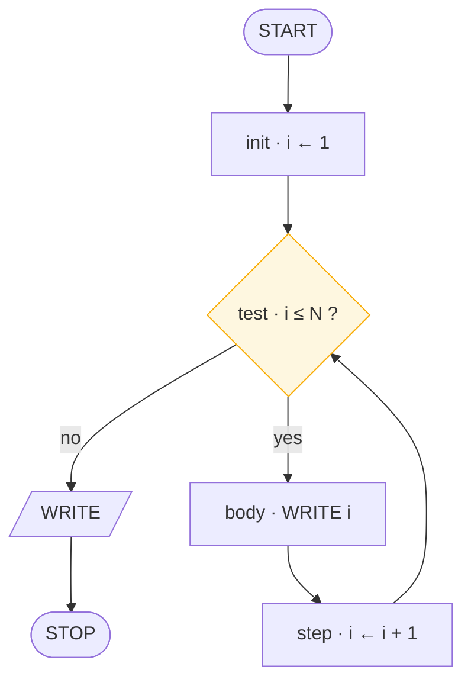
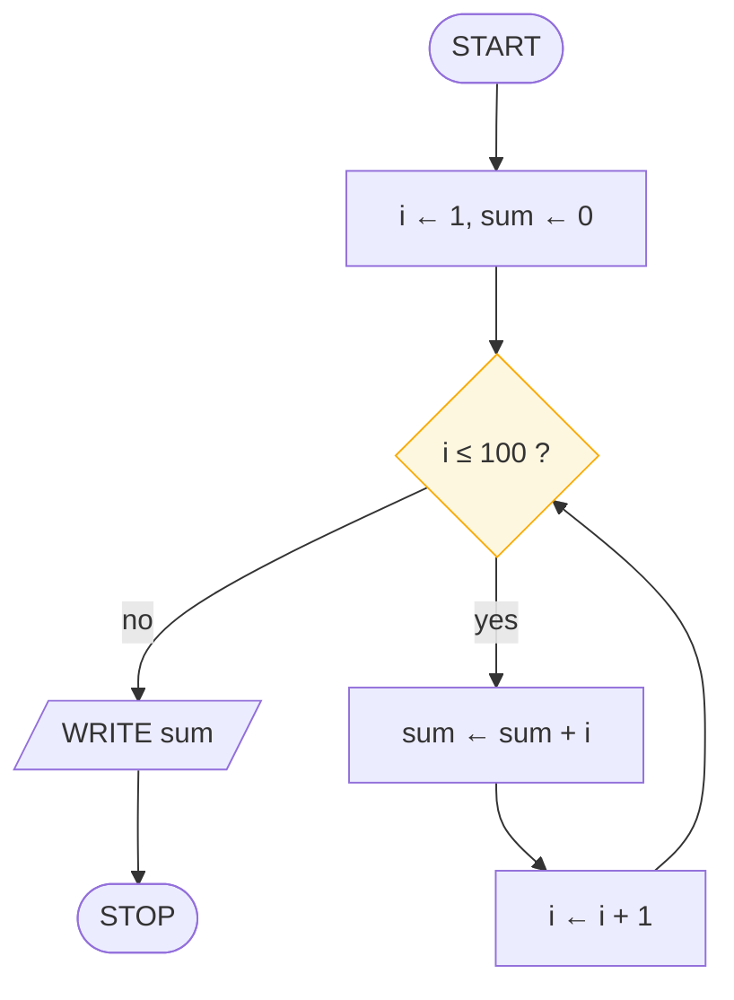
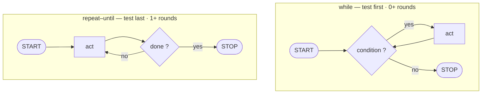

# Loops and Trace Tables

> **Lesson 4 of 6** — The four organs of a loop, counters and accumulators, and
> the cheapest bug hunt in programming.

---

## The case for loops

A computer's first superpower isn't speed. It's patience — perfect, infinite
patience. The loop is how you rent it.

Without a loop, printing the numbers 1 to 100 needs a hundred boxes. With a loop,
it needs five symbols — and it would print to a million just as easily.

> That collapse is the whole discipline of programming: a hundred actions become
> five symbols.

## The four organs of every loop

Every loop ever written has the same four parts. Learn to see them and loops stop
being scary; they become furniture.

| Organ | Question it answers | In code |
|-------|--------------------|---------|
| **init** | Where does the counter start? | `i = 1` |
| **test** | When do we stop? | `i <= N` |
| **body** | What happens each round? | `print(i)` |
| **step** | How do we get closer to stopping? | `i += 1` |



```
IN  N · DO  repeat while i ≤ N · OUT  1 2 3 … N
```

Trace the chart for N = 3: init puts i at 1. The test passes three times — body
prints 1, step makes 2; body prints 2, step makes 3; body prints 3, step makes 4.
Now the test fails and the program stops. Three prints, four tests.

The `for` loop you will meet in real code is just these four organs pre-assembled
— a while wearing a suit:

```python
n = int(input("n = "))
for i in range(1, n + 1):
    print(i)  # init · test · step hide here
```

> **The `step` organ is not optional.** A loop whose step does not make the test
> false is an infinite loop. You have drawn a trap, not a loop.

## Counters and accumulators

Two small ideas carry most beginner algorithms.

- A **counter** counts (`i`). It moves by 1 each round.
- An **accumulator** collects (`sum`). It moves by whatever the body computes.

Between them they are the engine of ninety percent of beginner algorithms — and
plenty of professional ones.

**Sum to 100.**



```
IN — · DO  collect 1…100 into sum · OUT  5050
```

```python
total, i = 0, 1
while i <= 100:
    total += i
    i += 1
print(total)   # 5050 — Gauss knew at age 8
```

Notice both start at a **neutral value**: the counter at 1 (or 0), the accumulator
at **0 — the identity for addition**. Starting a sum at 0 and a product at 1 is
the same instinct.

| You are computing | Start the accumulator at | Because |
|-------------------|--------------------------|---------|
| A sum | `0` | 0 + x = x — the identity |
| A product | `1` | 1 × x = x — the identity |
| A minimum | the first item | You have no comparison yet |
| A maximum | the first item | Same reason |
| A count | `0` | Nothing seen yet |

**Factorial** is the same chart wearing a different coat. Additions became
multiplications, the accumulator starts at 1 instead of 0 — the skeleton is
untouched.

```python
n = int(input("n = "))
f, i = 1, 1
while i <= n:
    f = f * i
    i = i + 1
print(f)   # 5! = 120
```

> That's the real lesson: you don't memorise a hundred algorithms. You learn a few
> skeletons and recognise which one you're looking at.

## The dry run — a trace table

A **dry run** means you become the CPU. One column per variable, one row per step,
no skipping. Slow — and merciless: every flaw in the chart surfaces while it still
costs nothing.

**Sum of 1…3**, the tiny case:

| step | i | i ≤ 3 ? | action | sum |
|------|---|---------|--------|-----|
| init | 1 | — | `sum ← 0` | 0 |
| 1 | 1 | yes | `sum ← 0 + 1` | 1 |
| 2 | 2 | yes | `sum ← 1 + 2` | 3 |
| 3 | 3 | yes | `sum ← 3 + 3` | 6 |
| **exit** | 4 | **no** | `WRITE 6` | 6 |

**Odd or even, N = 7.** Three rows and the branch choice is on record:

| step | symbol | N | N mod 2 | output |
|------|--------|---|---------|--------|
| 1 | `READ N` | 7 | — | — |
| 2 | `N mod 2 = 0 ?` | 7 | 1 | no |
| **3** | `WRITE "Odd"` | 7 | — | **Odd** |

If a classmate's chart printed "Even", their table shows exactly *which row* went
wrong. No arguing, just evidence.

### How to dry-run properly

1. **Pick the smallest interesting input.** An empty name, a zero, an odd number.
   Edges first, middles later.
2. **One column per variable, one row per step.** You are the CPU: slow, literal,
   merciless.
3. **The last row is the verdict.** If it disagrees with what you meant, the bug
   is on your paper — congratulations, it never reached the screen.

> Dry-running a chart takes two minutes. Debugging the same flaw in code takes an
> evening. **Same bug, different rent.**

Pick the **smallest interesting input**. If the chart survives 3, it survives 3
million — the shape doesn't change.

## Test first, or test last

Same organs, different order — and the difference matters.



| | `while` | `repeat–until` |
|---|---|---|
| Tests | before the body | after the body |
| Minimum runs | **0** | **1** |
| Continues while | condition is **true** | condition is **false** |
| Use for | "while there is more to do" | "do this at least once" |

Mind the phrasing, too. A while continues **while** the condition is true; a
repeat-until continues **until** it becomes true. Inverted logic, same machine.

Perfect for "ask for a password, then check it" — you must ask at least once.

Python has no do-while, so you fake it:

```python
while True:
    x = int(input("x = "))
    if x == 0:
        break          # the exit gate
    print(x * 2)
```

## Quick Reference — the loop skeleton

```
init      set the counter and the accumulator to neutral values
test      one yes/no question at the top of the cycle
body      the work, one action per box
step      move the counter toward the exit — never omit this
```

| Symptom | Cause |
|---------|-------|
| Runs forever | The step never makes the test false |
| Runs zero times | Test is false on arrival — check the init values |
| Off by one | `>` versus `≥`, or `range(1, n)` versus `range(1, n+1)` |
| Wrong total | Accumulator started at 1 instead of 0 (or vice versa) |

## What to take away

- Four organs: init, test, body, step. Every loop, without exception
- The step is what separates a loop from a trap
- Counters move by 1; accumulators move by what the body computes
- Neutral start values: 0 for sums, 1 for products
- `while` may run zero times; `repeat–until` always runs at least once
- Trace tables find bugs while they still cost minutes instead of evenings

## Next

**[Design Method and Review Checklist](design-method-and-review.md)** — turning a
wordy problem into a chart in five moves, and the four ways charts go wrong.

---

## Persian

[حلقه‌ها و جدول ردیابی](loops-and-trace-tables_fa.md)