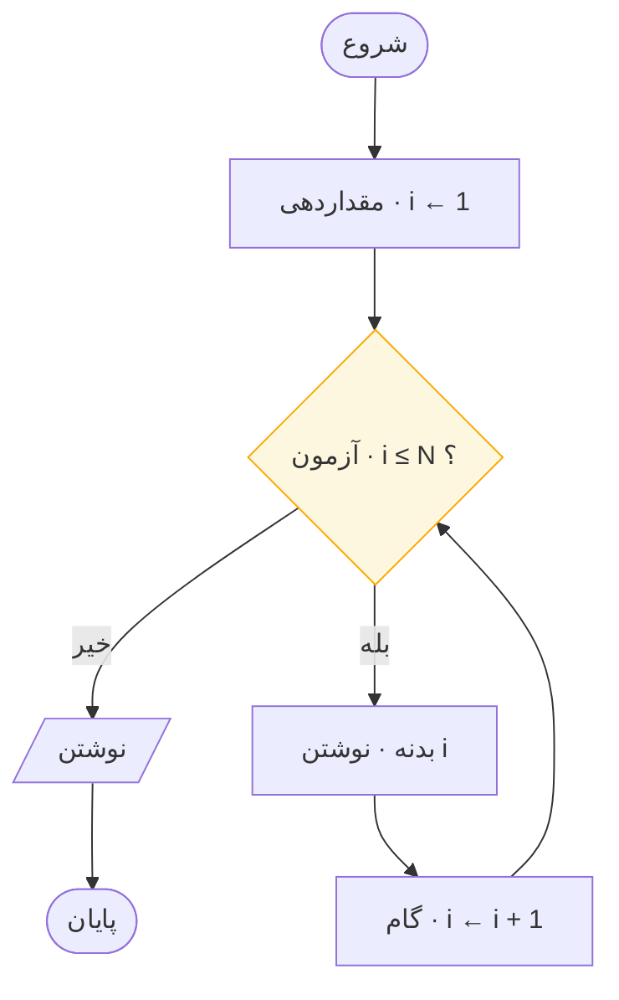
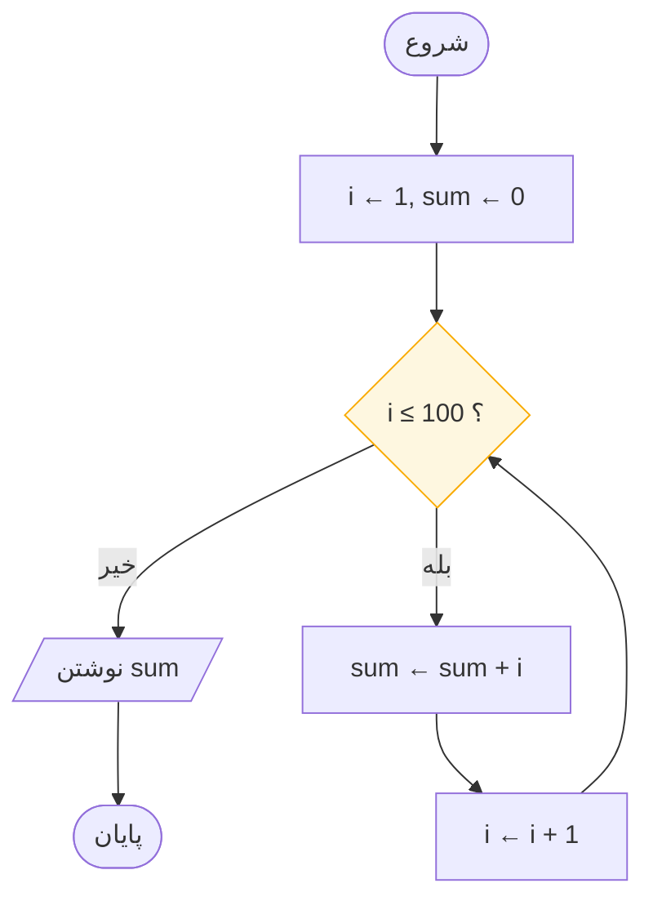
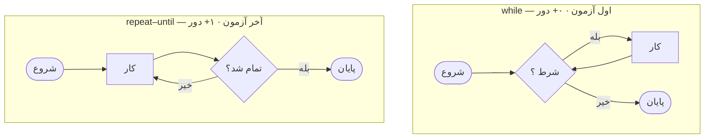

# حلقه‌ها و جدول ردیابی

> **درس ۴ از ۶** — چهار اندام یک حلقه، شمارنده‌ها و انباشتگرها، و ارزان‌ترین
> شکار اشکال در برنامه‌نویسی.

---

## ضرورت حلقه‌ها

نخستین توانایی یک کامپیوتر سرعت نیست. صبر است — صبر بی‌نهایت و کامل. حلقه راهی
است که آن را اجاره می‌گیرید.

بدون حلقه، چاپ کردن اعداد ۱ تا ۱۰۰ صد جعبه می‌خواهد. با حلقه، پنج نماد لازم است —
و به همان روال تا یک میلیون هم چاپ می‌کند.

> همین فشرده‌سازی، تمام انضباط برنامه‌نویسی است: صد کنش به پنج نماد تبدیل می‌شود.

## چهار اندام هر حلقه

هر حلقه‌ای که تاکنون نوشته شده چهار بخش یکسان دارد. با دیدن آن‌ها حلقه‌ها دیگر
ترسناک نیستند؛ به اثاثیه تبدیل می‌شوند.

| اندام | پرسشی که پاسخ می‌دهد | در کد |
|-------|--------------------|------|
| **مقداردهی اولیه** | شمارنده از کجا شروع می‌شود؟ | `i = 1` |
| **آزمون** | کِی متوقف شویم؟ | `i <= N` |
| **بدنه** | در هر دور چه می‌شود؟ | `print(i)` |
| **گام** | چگونه به پایان نزدیک می‌شویم؟ | `i += 1` |



```
IN  N · DO  تکرار تا وقتی i ≤ N · OUT  1 2 3 … N
```

نمودار را برای N = ۳ ردیابی کنید: مقداردهی i را روی ۱ می‌گذارد. آزمون سه بار قبول
می‌شود — بدنه ۱ را چاپ می‌کند و گام ۲ می‌سازد؛ بدنه ۲ را چاپ می‌کند و گام ۳ می‌سازد؛
بدنه ۳ را چاپ می‌کند و گام ۴ می‌سازد. حالا آزمون رد می‌شود و برنامه متوقف می‌شود.
سه چاپ، چهار آزمون.

حلقهٔ `for` که در کد واقعی می‌بینید فقط همین چهار اندام از پیش سرهم‌شده است — یک
while با کت‌وشلوار:

```python
n = int(input("n = "))
for i in range(1, n + 1):
    print(i)  # مقداردهی · آزمون · گام اینجا پنهان است
```

> **اندام گام اختیاری نیست.** حلقه‌ای که گامش آزمون را نادرست نمی‌کند، حلقهٔ
> بی‌نهایت است. شما تله کشیده‌اید، نه حلقه.

## شمارنده‌ها و انباشتگرها

دو ایدهٔ کوچک بیشتر الگوریتم‌های مبتدی را حمل می‌کنند.

- **شمارنده** می‌شمارد (`i`). هر دور یکی جلو می‌رود.
- **انباشتگر** جمع می‌کند (`sum`). هر دور به اندازهٔ آنچه بدنه حساب کرده حرکت می‌کند.

این دو با هم موتور نود درصد الگوریتم‌های مبتدی‌اند — و البته الگوریتم‌های حرفه‌ای
زیادی هم.

**جمع ۱ تا ۱۰۰.**



```
IN — · DO  جمع ۱…۱۰۰ در sum · OUT  5050
```

```python
total, i = 0, 1
while i <= 100:
    total += i
    i += 1
print(total)   # 5050 — گاوس در ۸ سالگی می‌دانست
```

توجه کنید هر دو با **مقدار خنثی** شروع می‌شوند: شمارنده با ۱ (یا ۰)، و انباشتگر
با **۰ — عنصر خنثی برای جمع**. شروع جمع از ۰ و شروع حاصل‌ضرب از ۱، همان غریزه است.

| آنچه حساب می‌کنید | انباشتگر از چه شروع شود | چرا |
|------------------|------------------------|-----|
| جمع | `0` | ۰ + x = x — عنصر خنثی |
| حاصل‌ضرب | `1` | ۱ × x = x — عنصر خنثی |
| کمینه | اولین عضو | هنوز مقایسه‌ای ندارید |
| بیشینه | اولین عضو | همان دلیل |
| شمارش | `0` | هنوز چیزی ندیده‌اید |

**فاکتوریل** همان نمودار با پوششی متفاوت است. جمع‌ها به ضرب تبدیل شدند، و انباشتگر
به‌جای ۰ با ۱ شروع می‌شود — اسکلت دست‌نخورده است.

```python
n = int(input("n = "))
f, i = 1, 1
while i <= n:
    f = f * i
    i = i + 1
print(f)   # 5! = 120
```

> این درس اصلی است: شما صد الگوریتم حفظ نمی‌کنید. چند اسکلت یاد می‌گیرید و
> تشخیص می‌دهید کدام را دارید نگاه می‌کنید.

## اجرای خشک — جدول ردیابی

**اجرای خشک** یعنی شما نقش پردازنده را بازی می‌کنید. برای هر متغیر یک ستون، برای
هر گام یک ردیف، بدون رد کردن. کند — و بی‌رحم: هر نقص نمودار درستی وقتی پیدا می‌شود
که هنوز هزینه‌ای نداشته.

**جمع ۱ تا ۳**، مورد کوچک:

| گام | i | i ≤ 3 ؟ | کنش | sum |
|-----|---|---------|------|-----|
| مقداردهی | 1 | — | `sum ← 0` | 0 |
| ۱ | 1 | بله | `sum ← 0 + 1` | 1 |
| ۲ | 2 | بله | `sum ← 1 + 2` | 3 |
| ۳ | 3 | بله | `sum ← 3 + 3` | 6 |
| **خروج** | 4 | **خیر** | `نوشتن 6` | 6 |

**زوج یا فرد، N = ۷.** سه ردیف و انتخاب شاخه ثبت شد:

| گام | نماد | N | N mod 2 | خروجی |
|-----|------|---|---------|--------|
| ۱ | `خواندن N` | 7 | — | — |
| ۲ | `N mod 2 = 0 ؟` | 7 | 1 | خیر |
| **۳** | `نوشتن "فرد"` | 7 | — | **فرد** |

اگر نمودار همکلاسی شما «زوج» چاپ کرد، جدولش دقیقاً نشان می‌دهد *کدام* ردیف اشتباه
بود — بدون بحث، فقط مدرک.

### چطور درست اجرای خشک کنیم

۱. **کوچک‌ترین ورودی جالب را انتخاب کنید.** یک نام خالی، صفر، عددی فرد. اول
   لبه‌ها، بعد میانه‌ها.
۲. **برای هر متغیر یک ستون، برای هر گام یک ردیف.** شما پردازنده‌اید: کند، تحت
   حرف، بی‌رحم.
۳. **ردیف آخر، حکم است.** اگر با آنچه می‌خواستید نمی‌خواند، اشکال روی کاغذ
   شماست — تبریک، هرگز به صفحه نرسید.

> اجرای خشک یک نمودار دو دقیقه طول می‌کشد. اشکال‌زدایی همان نقص در کد یک عصر
> طول می‌کشد. **همان اشکال، اجارهٔ متفاوت.**

**کوچک‌ترین ورودی جالب** را انتخاب کنید. اگر نمودار از ۳ جان سالم به در ببرد، از
۳ میلیون هم جان سالم به در می‌برد — شکل تغییر نمی‌کند.

## اول آزمون، یا آخر آزمون

همان اندام‌ها، ترتیب متفاوت — و تفاوت مهم است.



| | `while` | `repeat–until` |
|---|---|---|
| آزمون | پیش از بدنه | پس از بدنه |
| کمینهٔ اجرا | **۰** | **۱** |
| ادامه می‌دهد تا وقتی | شرط **درست** باشد | شرط **نادرست** باشد |
| برای | «تا وقتی کاری مانده» | «این کار را دست‌کم یک بار بکن»**

به نحوهٔ بیان هم دقت کنید. یک while **تا وقتی** شرط درست باشد ادامه می‌دهد؛ یک
repeat-until ادامه می‌دهد **تا وقتی** که درست شود. منطق معکوس، همان ماشین.

مناسب برای «برای رمز عبور بپرس، بعد بررسی کن» — باید دست‌کم یک بار بپرسید.

پایتون do-while ندارد، پس جعلش می‌کنید:

```python
while True:
    x = int(input("x = "))
    if x == 0:
        break          # دروازهٔ خروج
    print(x * 2)
```

## مرجع سریع — اسکلت حلقه

```
مقداردهی   شمارنده و انباشتگر را روی مقادیر خنثی بگذار
آزمون      یک پرسش بله/خیر در بالای چرخه
بدنه       کار، هر جعبه یک کار
گام        شمارنده را به سمت خروج ببر — هرگز حذفش نکن
```

| نشانه | علت |
|---|-------|
| تا ابد اجرا می‌شود | گام هرگز آزمون را نادرست نمی‌کند |
| صفر بار اجرا می‌شود | آزمون در لحظهٔ ورود نادرست است — مقادیر اولیه را بررسی کنید |
| یک واحد اختلاف | `>` در برابر `≥`، یا `range(1, n)` در برابر `range(1, n+1)` |
| مجموع اشتباه | انباشتگر با ۱ شروع شده به‌جای ۰ (یا برعکس) |

## آنچه باید به خاطر بسپارید

- چهار اندام: مقداردهی، آزمون، بدنه، گام. هر حلقه، بدون استثنا
- گام چیزی است که حلقه را از تله جدا می‌کند
- شمارنده‌ها یکی جلو می‌روند؛ انباشتگرها به اندازهٔ محاسبهٔ بدنه
- مقدار شروع خنثی: ۰ برای جمع، ۱ برای ضرب
- `while` ممکن است صفر بار اجرا شود؛ `repeat–until` همیشه دست‌کم یک بار
- جدول‌های ردیابی اشکالات را وقتی هنوز ارزان‌اند پیدا می‌کنند

## بعدی

**[روش طراحی و چک‌لیست بازبینی](design-method-and-review_fa.md)** — تبدیل یک
مسئلهٔ پرکلمه به نمودار در پنج گام، و چهار راهی که نمودارها خراب می‌شوند.

---

## English

[Loops and Trace Tables](loops-and-trace-tables.md)