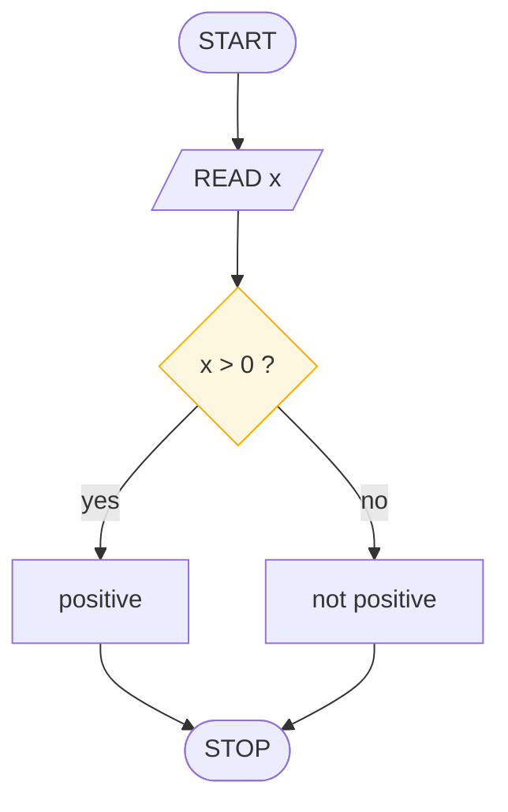

# Why Draw Before You Code

> **Lesson 1 of 6** — The case for designing on paper before you touch a keyboard.

---

**Syntax changes. Logic doesn't.**

Beginners usually fail at two things at once: getting the logic right, and getting
the syntax right. When both are broken in the same line, you cannot tell which one
to fix. A chart isolates the logic so that the syntax, when you finally get to it,
can be trivial.

## Four reasons this pays off immediately

**01 — It separates the two hard problems.**
Beginners fail at logic and syntax simultaneously. A chart isolates the logic so
syntax can be trivial later. Once the flow is right, writing it in Python is a
mechanical transcription, and mechanical steps do not consume attention.

**02 — It is language-agnostic.**
Draw once, implement in Python, C, Java, Rust. The chart outlives every dialect.

**03 — Bugs are cheaper on paper.**
A dry run costs minutes. The same bug, found at 2 a.m. in code, costs an evening.

**04 — It is a standard (ISO 5807).**
A chart drawn in Cairo reads the same in Copenhagen. Symbols are the lingua franca
of logic, and the standard has been stable since the 1970s.

## One chart, any language

The same decision in three dialects:

```python
if x > 0: print("positive")      # python
```
```c
if (x > 0) printf("positive");   /* c */
```
```javascript
if (x > 0) console.log("positive") // javascript
```

Three surfaces, one shape. The shape is the thing worth designing carefully.



## What a chart deliberately leaves out

Look at the diagram above. It contains no semicolons, no parentheses rules, no
imports, no type declarations, nothing about how `"positive"` will be rendered.

That absence is the feature. A chart records only:

- **What** data moves
- **Which order** things happen in
- **Where** the flow chooses

Everything else — formatting, error handling, types, libraries — belongs to the
code and to the programmer's taste. The moment a chart starts worrying about
pixels or string escapes, it has stopped being a chart and started being a
half-written program that nobody can run.

## When a chart is the wrong tool

Being honest about this matters more than being enthusiastic.

| Situation | Better tool |
|-----------|-------------|
| One obvious statement, no choices | Just write it |
| Data structures doing the work (a hash lookup) | Prose |
| Many actors and handoffs | UML activity diagram |
| Deployment and infrastructure | Architecture diagram |
| Business rules with dozens of edge cases | Decision table |
| Long, branchy logic with lots of state | Pseudocode |

Flowcharts earn their keep when logic is the hard part. They are not a universal
notation, and reaching for one when plain code would be clearer is its own kind of
mistake.

## The cost, honestly

A chart costs time to draw, and that time is wasted if the problem turns out to be
trivial. The heuristic that works in practice:

> If you cannot describe the solution in a sentence, draw the chart. If you can,
> probably just write the code.

For anything with a fork, a loop, or more than a handful of steps, the chart pays
for itself on the first bug it catches.

## What to take away

- Designing and typing are different activities with different failure modes
- Separate them and each becomes easier
- A chart is language-independent and standard-governed
- A chart omits syntax on purpose — that is what makes it durable
- Not every problem deserves one

## Next

**[The Six Symbols](flowchart-symbols.md)** — the vocabulary. Once you can name
the shapes, you can read any chart written since 1974.

---

## Persian

[چرا قبل از کدنویسی رسم می‌کنیم](why-draw-before-you-code_fa.md)