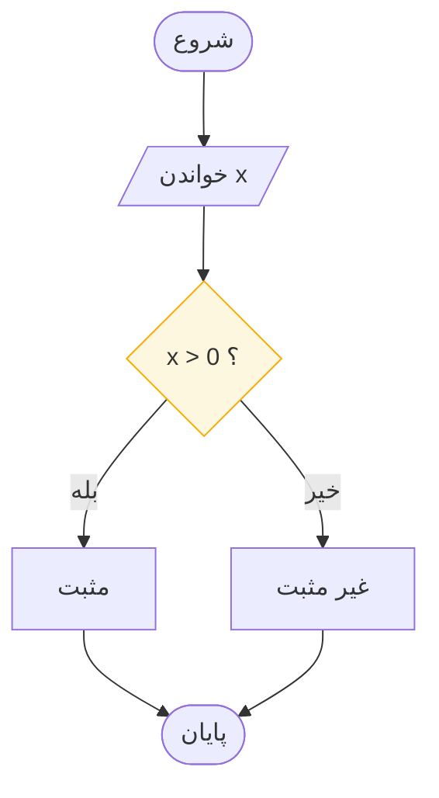

# چرا قبل از کدنویسی رسم می‌کنیم

> **درس ۱ از ۶** — ضرورت طراحی روی کاغذ پیش از دست زدن به صفحه‌کلید.

---

**نحو تغییر می‌کند. منطق تغییر نمی‌کند.**

مبتدی‌ها معمولاً هم‌زمان با دو چیز شکست می‌خورند: درست درآوردن منطق، و درست
نوشتن نحو. وقتی هر دو در یک خط خراب باشند، نمی‌توانید تشخیص دهید کدام را باید
درست کنید. نمودار، منطق را جدا می‌کند تا نحو — وقتی بالاخره به آن برسید —
ساده‌ترین کار ممکن باشد.

## چهار دلیل که این کار فوراً می‌ارزد

**۰۱ — دو مسئلهٔ سخت را از هم جدا می‌کند.**
مبتدی‌ها هم‌زمان در منطق و نحو شکست می‌خورند. نمودار منطق را جدا می‌کند تا نحو
بعداً ساده شود. وقتی جریان درست باشد، نوشتن آن در پایتون فقط رونویسی مکانیکی
است، و گام‌های مکانیکی توجه مصرف نمی‌کنند.

**۰۲ — مستقل از زبان است.**
یک بار رسم کنید، در پایتون، سی، جاوا یا راست پیاده‌سازی کنید. نمودار از هر گویشی
عمر بیشتری دارد.

**۰۳ — اشکالات روی کاغذ ارزان‌ترند.**
یک اجرای خشک چند دقیقه طول می‌کشد. همان اشکال، اگر ساعت ۲ بامداد در کد پیدا شود،
یک عصر طول می‌کشد.

**۰۴ — یک استاندارد است (ISO 5807).**
نموداری که در قاهره کشیده شود در کپنهاگ هم همان‌طور خوانده می‌شود. نمادها زبان
مشترک منطق‌اند، و این استاندارد از دههٔ ۱۹۷۰ ثابت مانده است.

## یک نمودار، هر زبانی

همان تصمیم در سه گویش:

```python
if x > 0: print("positive")      # python
```
```c
if (x > 0) printf("positive");   /* c */
```
```javascript
if (x > 0) console.log("positive") // javascript
```

سه سطح، یک شکل. آنچه ارزش طراحی دقیق دارد همان شکل است.



## آنچه نمودار آگاهانه حذف می‌کند

به نمودار بالا نگاه کنید. هیچ سمی‌کالن، هیچ قاعدهٔ پرانتز، هیچ import، هیچ اعلان
نوع، و هیچ چیزی دربارهٔ اینکه `"positive"` چگونه نمایش داده می‌شود ندارد.

همین نبودن، ویژگی است. نمودار تنها این‌ها را ثبت می‌کند:

- **چه** داده‌ای جابه‌جا می‌شود
- **با چه ترتیبی** اتفاقات می‌افتد
- **کجا** جریان انتخاب می‌کند

بقیهٔ کار — قالب‌بندی، مدیریت خطا، انواع، کتابخانه‌ها — متعلق به کد و سلیقهٔ
برنامه‌نویس است. به‌محض اینکه یک نمودار نگران پیکسل یا escape رشته شود، دیگر نمودار
نیست؛ برنامه‌ای نیمه‌کاره است که هیچ‌کس نمی‌تواند اجرایش کند.

## چه وقت نمودار ابزار اشتباهی است

صادق بودن در این مورد مهم‌تر از اشتیاق است.

| موقعیت | ابزار بهتر |
|---------|------------|
| یک دستور بدیهی، بدون هیچ انتخابی | همان کد را بنویسید |
| ساختارهای داده که کار را انجام می‌دهند (مثلاً جست‌وجوی هش) | نثر |
| بازیگران و تحویل‌کاری‌های زیاد | نمودار فعالیت UML |
| استقرار و زیرساخت | نمودار معماری |
| قواعد کسب‌وکار با ده‌ها حالت مرزی | جدول تصمیم |
| منطق طولانی و شاخه‌دار با حالت زیاد | شبه‌کد |

فلوچارت وقتی ارزش می‌گذارد که منطق، بخش سخت کار باشد. این‌که وقتی کد ساده واضح‌تر
است سراغ نمودار برویم، خودش نوع دیگری از اشتباه است.

## هزینه، صادقانه

نمودار وقت می‌برد، و آن وقت اگر مسئله ساده از آب درآید هدر رفته است. قاعده‌ای که
در عمل جواب می‌دهد:

> اگر نمی‌توانید راه‌حل را در یک جمله توضیح دهید، نمودار را بکشید. اگر می‌توانید،
> احتمالاً فقط کد را بنویسید.

برای هر چیزی با انشعاب، حلقه، یا بیش از چند گام، نمودار هزینه‌اش را با اولین اشکالی
که پیدا می‌کند پس می‌دهد.

## آنچه باید به خاطر بسپارید

- طراحی و تایپ، دو فعالیت متفاوت با دو الگوی شکست متفاوت‌اند
- آن‌ها را جدا کنید و هر دو آسان‌تر می‌شوند
- نمودار مستقل از زبان است و استاندارد دارد
- نمودار عمداً نحو را حذف می‌کند — همین چیزی است که آن را پایدار می‌کند
- هر مسئله‌ای لایق نمودار نیست

## بعدی

**[شش نماد فلوچارت](flowchart-symbols_fa.md)** — واژگان. با یادگیری این شش شکل،
می‌توانید هر نموداری را که از ۱۹۷۴ نوشته شده بخوانید.

---

## English

[Why Draw Before You Code](why-draw-before-you-code.md)