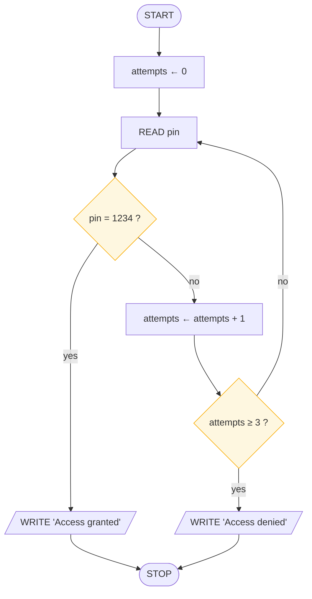
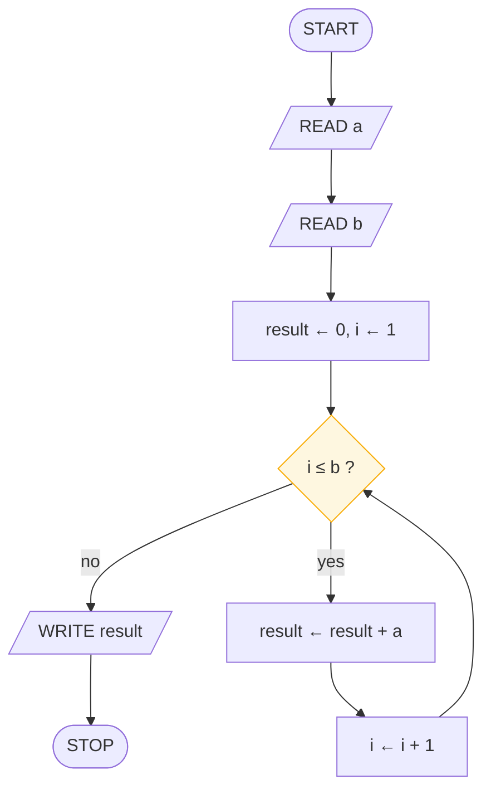
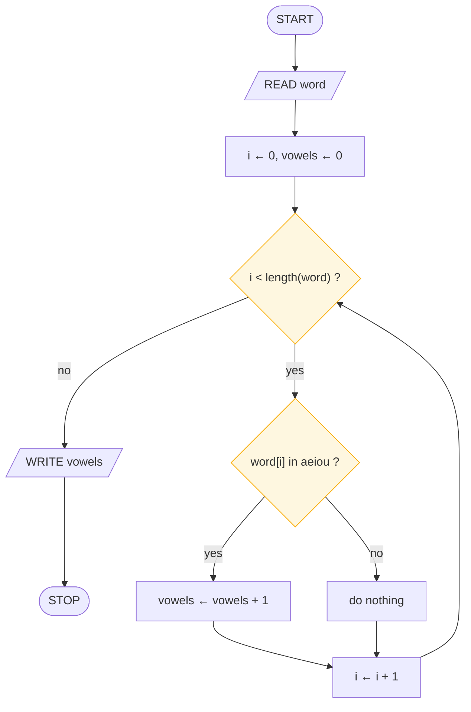

# Workshop: Three Briefs

> **Lesson 6 of 6** — Apply the five moves to three real problems.

---

Work on paper. Apply the five moves from
[Lesson 5](design-method-and-review.md) — restate, spill, shape, draw, dry-run —
and dry-run each chart before you call it done.

---

## Brief A · the PIN machine

> A cash machine holds the PIN **1234** and tolerates **three attempts**. Read a
> PIN each attempt. Print "Access granted" on success — or "Access denied" after
> the third failure.
>
> **Hint:** a counter, a loop, and two very different exits.

**What to notice.** Two exits from the loop — the shortcut (granted) and the
honest end (denied). Both roads are drawn; both reach a STOP. Note that the
counter increments *after* the wrong-PIN check, not before the read, or you will
reject the third attempt without ever comparing it.

Trace table

| attempt | pin read | pin = 1234 ? | attempts after | result |
|---------|----------|--------------|----------------|--------|
| 1 | 1111 | no | 1 | attempts ≥ 3 ? no → loop again |
| 2 | 2222 | no | 2 | attempts ≥ 3 ? no → loop again |
| 3 | 1234 | **yes** | 2 | WRITE "Access granted" → STOP |

---

## Brief B · multiplication by addition

> Given two positive integers **a** and **b**, compute a × b using only addition
> and a counter.
>
> **Hint:** Lesson 4's skeleton, wearing a coat.

An accumulator in disguise: **result ← 0**, then add **a** to it exactly **b**
times. The counter decides when to stop — the sum-to-100 chart with a variable
upper limit.

**What to notice.** The order of the organs. Init sets *two* things — the
accumulator to 0 (the identity for addition) and the counter to 1. The step comes
after the body, so the addition happens exactly `b` times, not `b − 1`.

Trace table — a = 7, b = 3

| step | i | i ≤ 3 ? | result after add | result |
|------|---|---------|------------------|--------|
| init | 1 | — | — | 0 |
| 1 | 1 | yes | 0 + 7 | 7 |
| 2 | 2 | yes | 7 + 7 | 14 |
| 3 | 3 | yes | 14 + 7 | 21 |
| exit | 4 | **no** | WRITE 21 | 21 |

---

## Brief C · the vowel counter

> Given a word, count its vowels (a, e, i, o, u).
>
> **Hint:** a loop over characters, a counter, and a decision with a long memory.

Walk the word one character at a time. The diamond asks "is this character one of
a, e, i, o, u?" — a compound condition is still **one** question, which is a rule
from [Lesson 2](flowchart-symbols.md). A counter collects the yeses.

**What to notice.** Two diamonds, one loop. This is iteration *wrapping* selection
— exactly the combination from the pattern table in
[Lesson 3](control-patterns.md). The "do nothing" branch is the plain `if` from
that lesson: it costs nothing, it just flows around.

Trace table — "cat"

| step | i | i < 3 ? | word[i] | a vowel ? | vowels | i after step |
|------|---|---------|---------|-----------|--------|---------------|
| init | 0 | — | — | — | 0 | — |
| 1 | 0 | yes | c | **no** | 0 | 1 |
| 2 | 1 | yes | a | **yes** | 1 | 2 |
| 3 | 2 | yes | t | **no** | 1 | 3 |
| exit | 3 | **no** | WRITE 1 | — | 1 | — |

---

## What to notice about all three

All three briefs — like most real programs — are just **loop + decision + counter**
in different costumes. When a new problem looks scary, hunt for the skeleton
underneath. It's almost always one you've already drawn.

| Brief | Loop | Decision(s) | Counter / accumulator |
|-------|------|-------------|----------------------|
| A · PIN machine | up to 3 attempts | is the PIN right? · three tries used? | `attempts` |
| B · multiply by adding | `b` times | have we done it `b` times? | `result` |
| C · vowel counter | once per character | is this a vowel? | `vowels` and `i` |

---

## The whole section on one sheet

Six symbols, three patterns, five moves. That is the entire art — the rest is
practice.

**Vocabulary**

| Symbol | Meaning |
|--------|---------|
| Terminator | One door in, doors out |
| Process | One box, one job, `←` means *becomes* |
| I/O parallelogram | Data leaning in or out |
| Decision | One yes/no question, labelled exits |
| Flow line | Down and right, or arrowed |
| Connector | Splices the long jumps |

**Discipline**

1. Restate · spill · shape · draw · dry-run
2. Every loop: init, test, body, step
3. Trace tables catch bugs while they're cheap
4. The silhouette predicts the cost
5. Chart → pseudocode → code, mechanically

## Final checklist

Before you call any chart finished:

- [ ] Exactly one START, every path reaches a STOP
- [ ] Every decision's exits labelled yes / no
- [ ] One arrow enters each symbol
- [ ] Arrows flow down or right, or carry an arrowhead
- [ ] No line crosses, touches, or cuts through a symbol
- [ ] Every loop has a step that can make its test false
- [ ] One action per rectangle, one question per diamond
- [ ] Dry-run on paper, with a table

## Where to go next

1. **[Session 1: What Is a Computer?](../../module-01-computers-and-programs/session-01/README.md)**
   — begin the course proper
2. **[Module 3: Algorithmic Thinking](../../module-03-algorithmic-thinking/README.md)**
   — the ten classic algorithms, with pseudocode beside each: largest of three,
   FizzBuzz, prime test, Euclid's GCD, Fibonacci, linear and binary search,
   bubble sort
3. **Module 4** — translate your Section 0 charts into Python and notice how
   boring that last step has become

> First you shape the flow. Then the flow shapes you.

---

## Persian

[کارگاه: سه تمرین](workshop-briefs_fa.md)