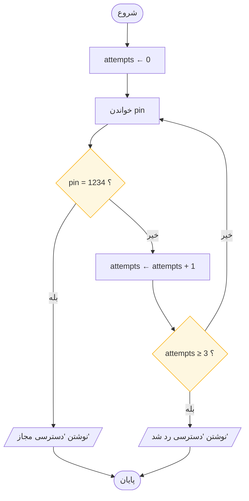
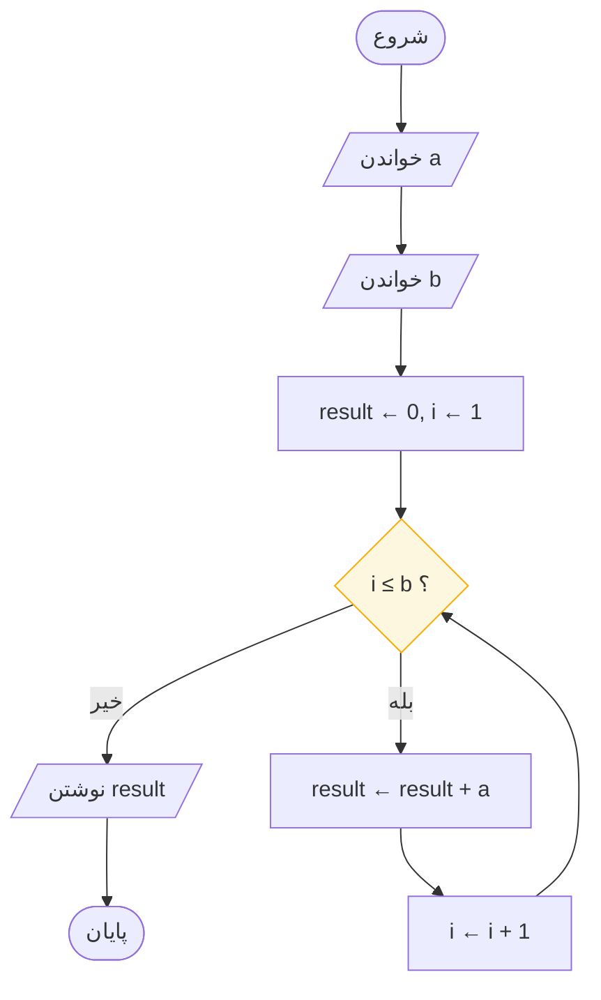
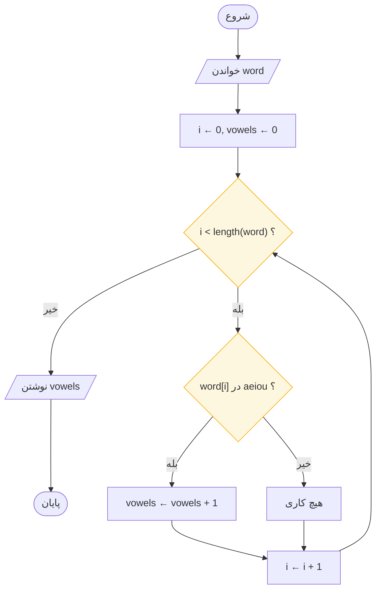

# کارگاه: سه تمرین

> **درس ۶ از ۶** — به کار بردن پنج گام روی سه مسئلهٔ واقعی.

---

روی کاغذ کار کنید. پنج گام
[درس ۵](design-method-and-review_fa.md) — بازگویی، ریختن، شکل‌دهی، رسم، اجرای
خشک — را به کار ببرید و هر نمودار را پیش از تمام‌کردن، اجرای خشک کنید.

---

## تمرین الف · ماشین رمز عبور

> یک دستگاه خودپرداز رمز عبور **۱۲۳۴** را نگه می‌دارد و **سه تلاش** را تحمل
> می‌کند. در هر تلاش یک رمز بخوان. در صورت موفقیت «دسترسی مجاز» چاپ کن — یا پس
> از سومین شکست «دسترسی رد شد».
>
> **راهنما:** یک شمارنده، یک حلقه، و دو خروجی بسیار متفاوت.

**آنچه باید دید.** دو خروجی از حلقه — میان‌بُر (پذیرش) و پایان صادقانه (رد). هر دو
راه رسم شده‌اند؛ هر دو به یک STOP می‌رسند. توجه کنید شمارنده *بعد* از بررسی رمز
اشتباه یکی اضافه می‌شود، نه قبل از خواندن — وگرنه تلاش سوم را بدون مقایسه رد
می‌کنید.

جدول ردیابی

| تلاش | رمز خوانده‌شده | pin = 1234 ؟ | attempts پس از | نتیجه |
|------|---------------|--------------|----------------|-------|
| ۱ | 1111 | خیر | 1 | attempts ≥ 3 ؟ خیر → حلقهٔ دوباره |
| ۲ | 2222 | خیر | 2 | attempts ≥ 3 ؟ خیر → حلقهٔ دوباره |
| ۳ | 1234 | **بله** | 2 | نوشتن «دسترسی مجاز» → پایان |

---

## تمرین ب · ضرب با جمع

> دو عدد صحیح مثبت **a** و **b** داده شده است، a × b را با **فقط جمع و یک
> شمارنده** حساب کنید.
>
> **راهنما:** اسکلت درس ۴ با پوششی متفاوت.

یک انباشتگر با پوششی: **result ← ۰**، سپس **a** را دقیقاً **b** بار به آن اضافه کن.
شمارنده تصمیم می‌گیرد کِی متوقف شویم — نمودار جمع ۱ تا ۱۰۰ با کران بالای متغیر.

**آنچه باید دید.** ترتیب اندام‌ها. مقداردهی اولیه *دو* چیز را تنظیم می‌کند —
انباشتگر روی ۰ (عنصر خنثی جمع) و شمارنده روی ۱. گام بعد از بدنه می‌آید، پس جمع
دقیقاً `b` بار انجام می‌شود، نه `b − 1`.

جدول ردیابی — a = ۷, b = ۳

| گام | i | i ≤ 3 ؟ | result پس از جمع | result |
|-----|---|---------|------------------|--------|
| مقداردهی | 1 | — | — | 0 |
| ۱ | 1 | بله | 0 + 7 | 7 |
| ۲ | 2 | بله | 7 + 7 | 14 |
| ۳ | 3 | بله | 14 + 7 | 21 |
| خروج | 4 | **خیر** | نوشتن 21 | 21 |

---

## تمرین ج · شمارش مصوت‌ها

> با توجه به یک واژه، مصوت‌های آن (a, e, i, o, u) را بشمارید.
>
> **راهنما:** حلقه روی نویسه‌ها، یک شمارنده، و یک تصمیم با حافظهٔ بلند.

روی واژه یکی‌یکی‌یکی حرکت کنید. لوزی می‌پرسد «آیا این نویسه یکی از a, e, i, o, u
است؟» — شرطی مرکب همچنان **یک** پرسش است، و این قانونی از
[درس ۲](flowchart-symbols_fa.md) است. یک شمارنده بله‌ها را جمع می‌کند.

**آنچه باید دید.** دو لوزی، یک حلقه. این تکرار است که **انتخاب** را در بر دارد —
دقیقاً همان ترکیب جدول الگوها در [درس ۳](control-patterns_fa.md). شاخهٔ «هیچ کاری»
همان `if` سادهٔ آن درس است: هیچ هزینه‌ای ندارد، فقط از کنارش عبور می‌کند.

جدول ردیابی — «cat»

| گام | i | i < 3 ؟ | word[i] | مصوت ؟ | vowels | i پس از گام |
|-----|---|---------|---------|--------|--------|--------------|
| مقداردهی | 0 | — | — | — | 0 | — |
| ۱ | 0 | بله | c | **خیر** | 0 | 1 |
| ۲ | 1 | بله | a | **بله** | 1 | 2 |
| ۳ | 2 | بله | t | **خیر** | 1 | 3 |
| خروج | 3 | **خیر** | نوشتن 1 | — | 1 | — |

---

## آنچه باید دربارهٔ هر سه دید

هر سه تمرین — مثل بیشتر برنامه‌های واقعی — فقط **حلقه + تصمیم + شمارنده** با
لباس‌های متفاوت‌اند. وقتی مسئلهٔ تازه ترسناک به نظر می‌رسد، دنبال اسکلت زیرش بگردید.
تقریباً همیشه اسکلتی است که قبلاً کشیده‌اید.

| تمرین | حلقه | تصمیم‌ها | شمارنده / انباشتگر |
|-------|------|----------|--------------------|
| الف · ماشین رمز عبور | تا ۳ تلاش | رمز درست است؟ · سه تلاش مصرف شد؟ | `attempts` |
| ب · ضرب با جمع | `b` بار | تا `b` بار انجام شد؟ | `result` |
| ج · شمارش مصوت‌ها | برای هر نویسه یک بار | آیا این مصوت است؟ | `vowels` و `i` |

---

## کل این بخش در یک صفحه

شش نماد، سه الگو، پنج گام. تمام هنر همین است — بقیه‌اش تمرین است.

**واژگان**

| نماد | معنا |
|------|------|
| پایان‌دهنده | یک ورودی، چند خروجی |
| پردازش | یک جعبه، یک کار، `←` یعنی *می‌شود* |
| متوازی‌الاضلاع ورودی/خروجی | داده که به داخل می‌آید یا بیرون می‌رود |
| تصمیم | یک پرسش بله/خیر، با خروجی‌های برچسب‌خورده |
| فلش جریان | رو به پایین و راست، یا با سرِ پیکان |
| رابط | پرش‌های بلند را می‌دوزد |

**انضباط**

۱. بازگویی · ریختن · شکل‌دهی · رسم · اجرای خشک
۲. هر حلقه: مقداردهی، آزمون، بدنه، گام
۳. جدول‌های ردیابی اشکالات را وقتی ارزان‌اند پیدا می‌کنند
۴. شکل نمودار هزینه را پیش‌بینی می‌کند
۵. نمودار ← شبه‌کد ← کد، مکانیکی

## چک‌لیست نهایی

پیش از اینکه هر نموداری را تمام‌شده اعلام کنید:

- [ ] دقیقاً یک START، هر مسیر به یک STOP می‌رسد
- [ ] خروجی‌های هر تصمیم با بله / خیر برچسب خورده‌اند
- [ ] فقط یک فلش وارد هر نماد می‌شود
- [ ] فلش‌ها رو به پایین یا راست، یا با سرِ پیکان
- [ ] هیچ خطی عبور نمی‌کند، لمس نمی‌کند، یا از نمادی نمی‌گذرد
- [ ] هر حلقه گامی دارد که می‌تواند آزمونش را نادرست کند
- [ ] هر مستطیل یک کار، هر لوزی یک پرسش
- [ ] اجرای خشک روی کاغذ، با جدول

## قدم بعدی

۱. **[جلسه ۱: کامپیوتر چیست؟](../../module-01-computers-and-programs/session-01/README.md)**
   — شروع رسمی دوره
۲. **[ماژول ۳: تفکر الگوریتمی](../../module-03-algorithmic-thinking/README.md)**
   — ده الگوریتم کلاسیک، با شبه‌کد در کنار هر کدام: بزرگ‌ترینِ سه عدد،
   fizzbuzz، تست اول بودن، ب‌م‌م افclid، فیبوناچی، جست‌وجوی خطی و دودویی،
   مرتب‌سازی حبابی
۳. **ماژول ۴** — نمودارهای بخش صفر را به پایتون ترجمه کنید و ببینید آخرین گام
   چقدر خسته‌کننده شده است

> اول جریان را شکل می‌دهی. بعد جریان تو را شکل می‌دهد.

---

## English

[Workshop: Three Briefs](workshop-briefs.md)